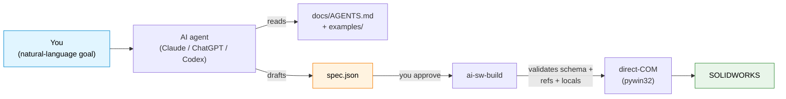

# ai-sw-bridge

> **Drive SOLIDWORKS from an AI assistant.** Hand Claude / ChatGPT / Codex a part to build and let it generate, validate, and run the JSON spec — without ever giving it a "do anything" button into your CAD model.

[](https://github.com/Thomas-Tai/ai-sw-bridge/actions/workflows/ci.yml)
[](pyproject.toml)
[](LICENSE)
[](#prerequisites)

**Language**: English · [繁體中文](docs/i18n/zh-TW/README.md) · [简体中文](docs/i18n/zh-CN/README.md)

## Who are you? → start here

This README is a **persona router**. Pick the row that matches you and jump
straight to the part written for you — the rest is signposted, not required
reading. Most of this page is the operator spine; developers and contributors
get a short teaser and a doc map.

| You are… | You want to… | Go to |
|---|---|---|
| **An operator** — a SOLIDWORKS user, not a coder | Install the bridge and drive it from your AI assistant | [**For operators — 5-minute quickstart**](#for-operators--5-minute-quickstart) · then hand [`docs/operator_guide.md`](docs/operator_guide.md) to your AI |
| **A Maker / system designer** — an idea, not a CAD design yet | Turn the idea into a CAD-ready engineering package before modeling | [**Industrial Design Intake**](docs/industrial_intake/README.md) — guided intake (or direct entry for complete designs), ending in a SolidWorks handoff |
| **A developer / integrator** | Call `SolidWorksClient`, embed the MCP server, or read the supported-surface contract | [**For developers & integrators**](#for-developers--integrators) |
| **A contributor** | Add a feature kind, fix a wall, understand the architecture | [**For contributors**](#for-contributors) |

New here and you just want it working? Read **[For operators](#for-operators--5-minute-quickstart)** top to bottom, then open the canonical [Operator Guide](docs/operator_guide.md) — it's the one file to hand your AI assistant.

## What this is

A bridge between AI agents and SOLIDWORKS. You describe a part in natural language; the agent emits a JSON spec; the bridge drives SW via the COM API to build it. Every mutation is **propose → approve → execute** — the AI never touches your CAD model without your green light.



The spec language covers **30 part-modelling feature types** today (13 sketch + 11 extrude/revolve + 3 modify + 3 pattern). [See the full list →](docs/spec_reference.md)

As of **v0.13**, the same tool surface is also reachable via the MCP server (`ai-sw-mcp`) — bring your own Claude Desktop, Cursor, or Continue.dev. [Jump to the MCP section ↓](#mcp-server--drive-the-bridge-from-claude-desktop--cursor--etc)

### What a spec looks like

You don't write COM calls or VBA — you describe the part as JSON. This is the
exact example the smoke test below builds (a 20 × 20 × 10 mm box with one 2 mm
fillet):

```json
{
  "schema_version": 1,
  "name": "filleted_box_demo",
  "features": [
    { "type": "sketch_rectangle_on_plane", "name": "SK_Box",
      "plane": "Front", "width": 20.0, "height": 20.0 },
    { "type": "boss_extrude_blind", "name": "Extrude_Box",
      "sketch": "SK_Box", "depth": 10.0 },
    { "type": "fillet_constant_radius", "name": "Fillet_TopRightEdge",
      "radius": 2.0, "edges": [ { "x": 10.0, "y": 0.0, "z": 10.0 } ] }
  ]
}
```

Features build in declared order; each `name` can be referenced by later
features. Any length is either a literal (mm) or a `{"rhs": "..."}` link to a
variable in a locals file. The full grammar is in
[`docs/spec_reference.md`](docs/spec_reference.md) — and the AI usually writes
this for you (step 3 below).

---

## For operators — 5-minute quickstart

**This is the spine of the project.** If you run SOLIDWORKS but don't write
code, everything you need is here — and the deeper, non-coder-friendly version
lives in the canonical **[Operator Guide → `docs/operator_guide.md`](docs/operator_guide.md)**.

### 1. Install

Two ways in. **The only hard prerequisite either way is SOLIDWORKS itself** —
installed and running (the bridge drives it via COM; nothing here installs
SOLIDWORKS). Tested on 2024 SP1; works on 2021 SP5+.

**A. No Python? Use the Windows installer (simplest — no terminal needed).**
Download `ai-sw-bridge-setup-<version>.exe` from the **Assets** of the
[latest release](https://github.com/Thomas-Tai/ai-sw-bridge/releases/latest) and
double-click it. It is **not code-signed**, so at the "Windows protected your PC"
prompt click **More info → Run anyway**. It bundles a private Python — you do
**not** need Python, Git, or a command line — runs the `pywin32` step for you,
and offers a checkbox to wire the MCP server. Then open a new terminal and go to
step 2. *(If the latest release's Assets show only "Source code," the `.exe`
isn't attached to that release yet — use path B for now.)*

**B. Prefer a scripted / terminal setup (pipx).** For developers, or anyone who
already works at a command line. You'll need 64-bit **Python 3.10+** and **Git**
on your `PATH` (SOLIDWORKS is 64-bit, so 32-bit Python won't attach), plus `pipx`:

```powershell
python -m pip install --user pipx
python -m pipx ensurepath            # then close and reopen your terminal

pipx install "ai-sw-bridge[mcp] @ git+https://github.com/Thomas-Tai/ai-sw-bridge.git"

# one-time: register pywin32's DLLs inside the pipx env (COM won't attach without it)
& "$(pipx environment --value PIPX_LOCAL_VENVS)\ai-sw-bridge\Scripts\python.exe" -m pywin32_postinstall -install
```

The `[mcp]` extra (in the command above) pulls in the MCP SDK so `ai-sw-mcp` can
run. `ai-sw-doctor` (next step) verifies the PATH and the pywin32 step for you.

### 2. Preflight (~5 seconds)

Before the first real command, let the bridge check your machine for you:

```powershell
ai-sw-doctor      # checks Python / pywin32 / PATH / a live SW seat / MCP registration
```

`ai-sw-doctor` is the operator preflight — it green-lights the four things that
break first-run installs (wrong bitness, missing `pywin32`, no seat, PATH gaps).
Fix anything it flags red before continuing.

### 3. Smoke test (~10 seconds)

Open SOLIDWORKS (a blank state is fine), then:

```powershell
ai-sw-probe                                              # confirms COM is alive
ai-sw-build --demo --no-dim     # builds a 20x20x10 box with one fillet
```

`ai-sw-probe` prints a JSON object on success (`{"ok": true, "sw_revision": "32.1.0", ...}`) — if `ok` is `true`, COM is alive.

`ai-sw-build` then prints a **seat banner** to stderr naming the exact SOLIDWORKS it's about to drive (its PID and your active document) and pauses for a `[y/N]` confirmation. That's the safety gate (Issue #7) — it's there so a build never lands in your session by surprise. Press **`y`**. (For unattended automation, add `--yes`/`-y` to skip the prompt.)

If a small filleted box appears in SW within ~3 seconds, the bridge works.

### 4. Hand the keys to your AI assistant

Two ways to let an AI drive the bridge — pick one.

**Chat-first (recommended) — talk to Claude Desktop, it builds directly.** This
wires the bridge's MCP server into the [Claude **Desktop** app](https://claude.ai/download)
(the installed app, *not* the browser) so Claude can call the build tool itself —
no terminal in the loop:

```powershell
ai-sw-doctor --register     # writes the MCP server into Claude Desktop's config (timestamped backup first)
```

Restart Claude Desktop, then just ask: *"Using ai-sw-bridge, build a 40 × 30 × 10 mm
plate with four Ø5 mm through-holes at the corners, 5 mm in from each edge."*
Claude drafts the spec, shows it to you, and **asks you to approve** before it
writes anything (the elicitation gate). Approve, and the part builds.

**Copy-paste (any AI, no MCP) — you run the command.** Open Claude / ChatGPT /
Codex and paste:

> I'm using **ai-sw-bridge** — a bridge that lets AI assistants drive SOLIDWORKS via the COM API. Before doing anything, read **[`docs/AGENTS.md`](docs/AGENTS.md)** — it tells you the rules, the spec format, and what needs my confirmation before running.
>
> My goal: *describe your part here — e.g. "build a 40 × 30 × 10 mm plate with four Ø5 mm through-holes at the corners, 5 mm in from each edge."*
>
> Propose a JSON spec for me to review before running `ai-sw-build`.

The agent reads [`docs/AGENTS.md`](docs/AGENTS.md), drafts a spec, and **stops**
for your review; you run `ai-sw-build` yourself. Same propose → approve → execute
loop, driven from the terminal.

**Stuck?** Try [`examples/README.md`](examples/README.md) (20 working specs, grouped by primitive) or [`docs/known_limitations.md`](docs/known_limitations.md) (sharp edges new users hit). The full walkthrough — written for a SOLIDWORKS veteran who doesn't code — is the [Operator Guide](docs/operator_guide.md).

**First run didn't work?**

| Symptom | Most likely cause | Fix |
|---|---|---|
| `ai-sw-probe` / `ai-sw-build`: *"command not found"* / *"not recognized"* | pipx's shim directory isn't on your `PATH` yet | run `pipx ensurepath`, then close and reopen your terminal — or run `ai-sw-doctor`, which detects this and tells you |
| `ai-sw-probe` returns `ok: false` or a COM error | SOLIDWORKS isn't running, or it's a different bitness than your Python | start SOLIDWORKS; use 64-bit Python (SW is 64-bit) |
| `ai-sw-build` seems to hang with a "Modify Dimension" popup in SW | parametric mode opens a blocking dialog per dimension | use `--no-dim` (the smoke test already does) — [why](docs/why_no_addim2.md) |
| A `[y/N]` prompt appears before anything builds | that's the seat-confirmation gate, **not** an error | press `y` to proceed, or pass `--yes` for automation |

## What ships in the box

**22 CLI commands + one MCP server** on your PATH after the `pipx install` above
(the MCP server needs the `[mcp]` extra to *run* — see the [MCP section](#mcp-server--drive-the-bridge-from-claude-desktop--cursor--etc)).
Each command declares a stability **tier** (`stable` / `experimental` / `deprecated`),
printed in its `--help` banner and enforced by `tests/test_cli_stability.py`. The
authoritative tier-per-command list + the SemVer promise live in
[`docs/PUBLIC_API.md`](docs/PUBLIC_API.md) — that file is the supported-surface
contract; this table is the friendly tour.

Every mutating command follows the same **propose → approve → execute** state
machine: the AI never changes a model without an explicit human / `--yes` gate.
There is no `--yolo` flag.

| Command | Tier | What it does | Read-only? |
|---|---|---|---|
| `ai-sw-probe` | experimental | COM connectivity check — confirms SW is reachable via `GetActiveObject` | ✅ |
| `ai-sw-doctor` | experimental | Operator preflight — checks Python / pywin32 / PATH / a live SW seat / MCP registration | ✅ |
| `ai-sw-observe` | stable | Inspect doc / features / equations / mates / bbox / volume / custom-props / screenshots / add-ins / MBD-PMI — JSON output | ✅ |
| `ai-sw-mutate` | stable | Propose → dry-run → commit (or undo) `*_locals.txt` variable changes. Subcommands: `propose` / `dry_run` / `commit` / `undo_last_commit`. Proposals persist to `./proposals/` (override via `AI_SW_BRIDGE_PROPOSALS`). | ⚠️ approval-gated |
| `ai-sw-batch` | experimental | Human-gated batch feature-commit. Executes a multi-feature plan (from MCP `sw_batch_plan`) behind a `[y/N]` gate; greens persist, fail-fast on the first fault. | ⚠️ approval-gated |
| `ai-sw-assembly` | stable | Propose-Approve-Execute assembly lifecycle (components + mates). Subcommands: `propose` / `dry_run` / `commit`. CLI-only, never MCP. | ⚠️ approval-gated |
| `ai-sw-drawing` | stable | Propose-Approve-Execute drawing lifecycle (views + annotations). Subcommands: `propose` / `dry_run` / `commit`. CLI-only, never MCP. | ⚠️ approval-gated |
| `ai-sw-properties` | stable | Propose-Approve-Execute custom-properties lifecycle. Subcommands: `propose` / `dry_run` / `commit`. CLI-only, never MCP. | ⚠️ approval-gated |
| `ai-sw-configurations` | stable | Multifile variant materialization. Subcommands: `propose` / `materialize`. Deep-merges variants over a base spec, builds each as a separate `.sldprt`. | — |
| `ai-sw-sketch-relations` | experimental | Propose-Approve-Execute sketch geometric relations (constraints). Subcommands: `propose` / `dry_run` / `commit`. CLI-only. | ⚠️ approval-gated |
| `ai-sw-sketch-edit` | experimental | Propose-Approve-Execute sketch editing ops (Convert / Offset / Trim / Pattern). Subcommands: `propose` / `dry_run` / `commit`. CLI-only. | ⚠️ approval-gated |
| `ai-sw-codegen` | experimental | Parameterize a recorded `.swp` macro against a locals file | — |
| `ai-sw-build` | stable | **Build a part from a JSON spec via direct-COM.** Three modes (`--no-dim`, `--deferred-dim`, parametric default). Safety: prints the target seat (PID + active doc) and pauses for `[y/N]` on an interactive TTY before the first COM write; `--yes`/`-y` skips the prompt for automation. Validation: `--validate-only`, `--dry-run`, `--lint`. Reliability: `--checkpoint[-encrypt]`, `--auto-retry`, `--reconnect`, `--verify-mass`. Output: `--save-as`, `--save-format`. Environment: `--disable-addins`/`--strict-addins`, `--enable-flag`/`--disable-flag`, `--log-level`/`--verbose`/`--quiet`, `--locale`. Run `ai-sw-build --help` for the canonical list. | — |
| `ai-sw-history` | experimental | Query L4 checkpoint history — `part` / `since` / `diff` / `rollback` subcommands | ⚠️ rollback writes |
| `ai-sw-apidoc` | experimental | RAG over the SOLIDWORKS API CHM corpus — `search` / `detail` / `members` / `examples` / `enum` subcommands. First run after a fresh clone: `python tools/build_api_index.py` to materialize the committed index. | ✅ |
| `ai-sw-memory` | experimental | **Design-Memory RAG** — semantic search over *your own* design history (past proposals/checkpoints). `build` (backfill the local index) / `search` / `stats`. Embeddings are computed **on-device**; the index is a private, gitignored artifact. | ✅ |
| `ai-sw-checkpoint` | experimental | Manage L4 encryption — `info` (no key needed) / `genkey` / `rekey` / `migrate` | — |
| `ai-sw-import` | experimental | Foreign-geometry import (STEP / IGES → `.sldprt`) with import diagnostics. Options: `--source`, `--output`, `--dry-run`, `--verify-volume`. | — |
| `ai-sw-export-dxf-flat` | experimental | Sheet-metal flat-pattern DXF export (`export` subcommand) — exports via `ExportToDWG2`, verifies entity count. | — |
| `ai-sw-motion` | experimental | Dynamic kinematic verification (`audit`) — drives a mate through its DOF, reports interference / clearance per step. | — |
| `ai-sw-solver` | experimental | Autonomous clearance solver (`resolve-clearance`) — drives a distance mate until clash-free, reverts on failure. | ⚠️ approval-gated |
| `ai-sw-urdf` | experimental | URDF export (assembly → ROS robot model). `export` writes `.urdf` + per-component STL meshes. No SW mutation. | ✅ |
| `ai-sw-mcp` | daemon | **MCP server (stdio transport)** for Claude Desktop, Cursor, Continue.dev, and other MCP-capable clients. Exposes 37 tools (read lanes + plan/elicit-gated writes). Bundled via the `[mcp]` extra in the `pipx install` above. | mixed |

Three build modes for `ai-sw-build` (use `--no-dim` for AI workflows; the others trade speed for live equation links). [Why `--no-dim` exists →](docs/why_no_addim2.md)

### Feature kinds you can add (36)

Beyond the base part, `ai-sw-build` / `ai-sw-batch` (and `sw_batch_plan` over MCP)
can add these **36 seat-proven** `feature_add` kinds to a model. Each is verified by
its geometric *effect* (volume / face / area / arc-length / ratio delta), never by a
bare "no error". The live source of truth is `client.features.list_kinds()`; kinds
that are walled out-of-process are listed in [`docs/DEFERRED.md`](docs/DEFERRED.md).

| Group | Kinds |
|---|---|
| Dress-up | `fillet_constant_radius`, `fillet_face`, `variable_radius_fillet`, `chamfer`, `shell`, `draft` |
| Patterns | `linear_pattern`, `circular_pattern`, `mirror_feature`, `sketch_driven_pattern` |
| Reference geometry | `ref_plane`, `ref_axis`, `ref_point`, `coordinate_system`, `bounding_box`, `com_point`, `mate_reference` |
| Curves | `composite`, `helix`, `spiral`, `project_curve`, `curve_through_xyz` |
| Surfaces | `planar_surface`, `offset_surface`, `knit` |
| Sheet metal | `base_flange`, `hem`, `sketched_bend` |
| Sweeps & shapes | `sweep`, `sweep_cut`, `dome`, `wizard_hole` |
| Bodies & boolean | `delete_body`, `intersect`, `scale` |
| Weldment | `structural_weldment` |

```python
from ai_sw_bridge.client import SolidWorksClient
SolidWorksClient().features.list_kinds()   # -> the 36 kinds above, sorted
SolidWorksClient().features.supports("helix")   # -> True
```

### Environment variables

| Variable | Default | What it controls |
|---|---|---|
| `AI_SW_BRIDGE_CAPTURES` | `./captures` | Where `sw_screenshot` writes PNGs |
| `AI_SW_BRIDGE_PROPOSALS` | `./proposals` | Where `ai-sw-mutate` proposal JSON files persist |
| `AI_SW_BRIDGE_FLAG_<NAME>` | unset | Override a feature flag (e.g. `AI_SW_BRIDGE_FLAG_BREP_INTERROGATION=1`). CLI `--enable-flag`/`--disable-flag` wins over the env var. |
| `NO_COLOR` | unset | Strips ANSI from stderr output (honored by `PlainFormatter`) |

`--checkpoint-encrypt env:NAME` reads the Fernet key from `$NAME` at build time; the variable name is your choice.

## MCP server — drive the bridge from Claude Desktop / Cursor / etc.

The MCP server (new in v0.13) exposes 37 tools to MCP-capable AI clients
over stdio. Same observation + planning surface as the CLI; just a different
transport. The tool set is pinned by name and payload shape in
`tests/mcp_lane/test_server_contract.py` (`EXPECTED_TOOLS`) — that test is the
contract, so any add/remove/rename fails CI loudly.


### Setup, registration & the full tool inventory

**Setup** (install + register with Claude Desktop / Cursor), the **full 37-tool
inventory**, the two **elicit-gated write tools** (`sw_build`,
`sw_batch_execute`), and the **deliberately-CLI-only** surface are documented in
[`docs/mcp_server_design.md`](docs/mcp_server_design.md) (§6.6 — operator setup &
current tool inventory).

Quick version: if you followed the
[operator quickstart](#for-operators--5-minute-quickstart), the `[mcp]` extra is
already installed — point your MCP client at the `ai-sw-mcp` executable
(`where ai-sw-mcp`) and restart the client. Then ask, e.g., "What's the bounding
box of the active part?" and the model selects `sw_bbox`.

[Full MCP server design + protocol detail →](docs/mcp_server_design.md)

## Limitations you should know before adopting

A short list. The [full known-limitations doc](docs/known_limitations.md) is required reading before authoring your own spec.

- **Windows only.** Non-negotiable — `pywin32` only runs on Windows.
- **`AddDimension2` opens a blocking popup in parametric mode.** Cannot be suppressed via any user preference toggle we've tried on SW 2024 SP1. Workaround: `--no-dim` mode skips the call entirely (geometry at literal target size, no equation link); `--deferred-dim` batches the popups at the end. AI-driven flows should default to `--no-dim`.
- **Face-sketch origin is the part-origin projection, not the face centroid.** A `center` offset on a face sketch resolves relative to where SW projects (0,0,0) onto the face, not to the visual face center. Bites everyone once. Documented.
- **Some advanced features are walled out-of-process.** A handful of feature kinds (e.g. `loft`, `combine`, `split`, `wrap`, the profile-sketch sheet-metal flanges) cannot be materialized through the COM boundary and are registered `DORMANT`/`WALLED` — they fail loud rather than silently no-op. See [`docs/DEFERRED.md`](docs/DEFERRED.md) for the kernel-wall classification.
- **No "describe the part in English and get geometry" for free.** The spec language is precise; the AI generates spec JSON, not freehand prose. The natural-language step happens in your chat with the agent, before the spec is drafted.

---

## For developers & integrators

`ai-sw-bridge` is also a Python library and an embeddable MCP server. One public
entry point — `SolidWorksClient` — fronts the whole surface; the CLI and the MCP
server are thin shells over it. Start with these four docs:

- **[`docs/PUBLIC_API.md`](docs/PUBLIC_API.md)** — the supported-surface contract: every public symbol, its stability tier, and the SemVer promise.
- **[`docs/tools_reference.md`](docs/tools_reference.md)** — the canonical CLI + MCP tool reference (flags, subcommands, payload shapes).
- **[`docs/AGENTS.md`](docs/AGENTS.md)** — the agent briefing: the rules, the spec format, and what needs human confirmation. Hand this to any AI you pair with.
- **[`USAGE.md`](USAGE.md)** — end-to-end usage recipes for the Python client and the CLI.

### Why an AI engineer should care

CAD automation has been a decade-long graveyard of fluent builder APIs and add-in frameworks (angelsix, xCAD, codestack, pyswx, pySldWrap). None of them solved the AI authoring problem — they all assume a *human* writes VBA or chains `.box().hole()` calls. AI agents don't think that way.

What's different here:

1. **JSON is the AI-native surface.** The spec is pure data, validated against a schema, validated against the locals file, validated against feature topology — *before* any SW call fires. The AI is good at data; the bridge is good at making sure the data is correct.
2. **Late-binding pywin32 works for the boring 95%.** Phase 0 proved that direct-COM dispatch covers the part-modelling API surface we need. The handful of methods that don't marshal (e.g. `SelectByID2`'s `Callout` OUT-param) have documented workarounds. [See the gotchas →](docs/known_gotchas.md)
3. **Safety is structural, not aspirational.** `ai-sw-mutate` ships a literal `propose → dry-run → review → commit` state machine. Rollback verification reads the file back from disk and compares. There is no `--yolo` flag.
4. **CHM is the source of truth for API signatures.** When a call returns `PARAMNOTOPTIONAL`, we don't guess — we re-extract from `sldworksapi.chm` and assert the arg count at runtime. The generated reference (`api_reference.md`) is not committed — regenerate it locally from [`tools/_api_extract_input.json`](tools/_api_extract_input.json). A fuller superset (`docs/sw_api_full.md`) is generated the same way but is not committed to the repository.

For the architecture and design rationale (why JSON specs over a fluent API, the layer model), read [`docs/CLASS_RELATION_MAP.md`](docs/CLASS_RELATION_MAP.md).

## For contributors

Adding a feature kind, fixing a kernel wall, or trying to understand the layer
model? These are your entry points:

- **[`CONTRIBUTING.md`](CONTRIBUTING.md)** — developer workflow, per-file port attribution, and the [CLA](CLA.md). Adding a `feature_add` kind means registering a handler *and* satisfying its contract obligations (the README kind table, an example, and a geometric-effect test).
- **[`docs/CLASS_RELATION_MAP.md`](docs/CLASS_RELATION_MAP.md)** — the architecture map: `client` → facades → registry → COM, and the design rationale.
- **[`CODESTYLE.md`](CODESTYLE.md)** — cross-cutting code discipline (two-stream I/O, fail-soft, STA threading).

The offline test suite is the spec: it must stay green (`pytest`, 3,700+ tests), plus the live-SW `solidworks_only` lane and the destructive `destructive_sw` recovery lane for seat-proof work.

## Project status

**Current release: `v1.7.1` — commercial, Production/Stable.** One public Python
entry point (`SolidWorksClient`), 22 CLI commands, a 37-tool MCP server, and a
36-kind `feature_add` registry behind the `ai-sw-batch` / `ai-sw-mutate` surface.
Validated against SOLIDWORKS 32.1.0 (2024 SP1); CI green on Win-2025 × Python
3.10 / 3.12 / 3.14. The offline suite is **3,700+ tests**, plus a live-SW
end-to-end lane (`solidworks_only`) and a destructive seat-death recovery lane
(`destructive_sw`).

Milestone arc (full detail in [CHANGELOG.md](CHANGELOG.md)):

- **v0.1–v0.3 — foundations.** `probe` / `observe` / `mutate` / Path C `codegen`;
  the JSON-spec builder (Motor Mount Plate, three build modes); first primitives.
- **v0.10–v0.13 — reliability & intelligence.** Feature flags, circuit breaker,
  SLI baselines, two-stream contract, CLI stability tiers; B-rep interrogation,
  the COM error envelope, RAG API-doc retrieval, L4 SQLite checkpoints + at-rest
  Fernet encryption; the `ai-sw-mcp` server + STA-threaded `ComExecutor`.
- **v0.14–v0.18 — capability epochs.** Assemblies & mates, drawings & annotations,
  custom properties, multifile configurations, sketch editing, surfaces,
  sheet-metal, curves, reference geometry, weldments — and the consolidation to a
  single `SolidWorksClient` facade (the free `sw_*` functions removed).
- **v1.0.0 — GA** (2026-06-23). First stable release; the `SolidWorksClient` facade
  is the sole supported Python API, SemVer in force.
- **v1.1–v1.4 — agentic batch & observability.** Transactional multi-feature
  `client.mutate.batch()` + `sw_batch_plan` / `sw_batch_execute`; the `intersect`
  lane; MBD/DimXpert PMI observability (`sw_observe_mbd`).
- **v1.5.0 — runtime resilience & design intelligence.** The `SupervisedSession`
  crash-recovery envelope (detect → respawn → idempotent replay, live-proven on a
  real seat) and a local, on-device Design-Memory RAG (`ai-sw-memory`).
- **v1.6.0 — self-healing batch + unified write-gate** (2026-06-26). Supervised
  recovery is the **default** batch path; **both** MCP write tools (`sw_build`,
  `sw_batch_execute`) gate every disk write behind in-chat human approval (MCP
  elicitation); proprietary commercial licensing; CI hardened (black / flake8 /
  mypy / import-linter / coverage / secret + CVE scanning, all blocking).

See [`docs/PUBLIC_API.md`](docs/PUBLIC_API.md) for the supported-surface contract
and [`docs/CLASS_RELATION_MAP.md`](docs/CLASS_RELATION_MAP.md) for the architecture map.

## Layout

```
ai-sw-bridge/
├── src/ai_sw_bridge/         # the bridge itself
│   ├── spec/                 #   JSON spec → direct-COM builder
│   │   ├── builder.py        #     build loop + non-sketch handlers + registry
│   │   ├── sketches/         #     SketchHandler ABC + 5 concrete handlers
│   │   └── ...
│   ├── brep/                 # L1 — B-rep interrogation (per-feature manifest)
│   ├── errors/               # L2 — build_error / wrapper / hints / circuit_breaker / auto_retry
│   ├── rag/                  # L3 — API RAG (sqlite-vec index + embedder)
│   ├── checkpoint/           # L4 — SQLite checkpoints (store / snapshot / rollback / crypto)
│   ├── com/                  #     ComExecutor + adapter factory (STA-thread COM safety)
│   ├── mcp/                  # Lane M — MCP server (FastMCP + @com_tool decorator)
│   ├── telemetry/            # local SQLite metrics + trace IDs (no PII / no auto-upload)
│   ├── flags/                # feature-flag registry + precedence resolver
│   └── cli/                  # 22 CLI entry points (tiered in cli/stability.py)
├── examples/                 # worked specs (start here when authoring)
├── docs/
│   ├── AGENTS.md             #   agent briefing — what the AI reads first
│   ├── operator_guide.md     #   canonical Operator Guide (hand this to your AI)
│   ├── spec_reference.md     #   per-primitive schema reference
│   ├── api_reference.md      #   CHM-verified SW API surface
│   ├── known_limitations.md  #   sharp edges + workarounds
│   ├── known_gotchas.md      #   things we learned the hard way
│   ├── DEFERRED.md           # ← v0.14+ backlog + indefinitely-deferred items
│   ├── ROADMAP.md
│   ├── mcp_server_design.md  # ← MCP server protocol + tool inventory + design rationale
│   ├── checkpoint_encryption_design.md  # ← L4 at-rest encryption (Fernet, 4 key sources)
│   └── CLASS_RELATION_MAP.md  # client / facades / registry / COM relation map
├── tools/                    # CHM extractor, drift/license lint, bundle, perf baselines, probe_mcp_tools, checkpoint_redact, spec_redact, example_roundtrip
├── spikes/                   # Phase 0 / v0.3 / v0.5 / v0.6 API probes
├── tests/                    # 3,750 offline tests, green on Python 3.10 / 3.12 / 3.14
│   ├── e2e_sw/               # end-to-end suite against live SW (solidworks_only marker)
│   ├── fault_injection/      # COM HRESULT injection (separate CI job)
│   ├── mcp_lane/             # MCP server contract + wire-level + snapshot fixtures
│   └── onboarding/           # quickstart smoke (no-SW-required)
├── CODESTYLE.md              # cross-cutting code discipline (two-stream, fail-soft, STA, etc.)
└── CONTRIBUTING.md           # developer workflow + per-file port attribution
```

## License

Commercial / proprietary — see [LICENSE](LICENSE) (a counsel-review template as
of v1.5.0). Releases v1.0.0–v1.4.0 were published under the MIT License and
remain available under those terms. Incorporated third-party components keep
their own licenses — see [THIRD-PARTY-NOTICES.md](THIRD-PARTY-NOTICES.md).
Contributions are accepted under the [CLA](CLA.md).

## Trademarks

SOLIDWORKS is a registered trademark of Dassault Systèmes SE. `ai-sw-bridge` is an
independent project and is **not affiliated with, authorized by, or endorsed by**
Dassault Systèmes. It drives SOLIDWORKS through the published COM API for
interoperability; all other trademarks are the property of their respective owners.

## Acknowledgments

SOLIDWORKS API patterns: [CodeStack](https://www.codestack.net/solidworks-api/). The Path C dim-binding fix (`EquationMgr.Add2` 3-arg form) came from their `document/dimensions/add-equation/` example.

Includes adapted code from [SolidworksMCP-python](https://github.com/andrewbartels1/SolidworksMCP-python) (MIT, ESPO Corporation 2025); see [THIRD-PARTY-NOTICES.md](THIRD-PARTY-NOTICES.md).
