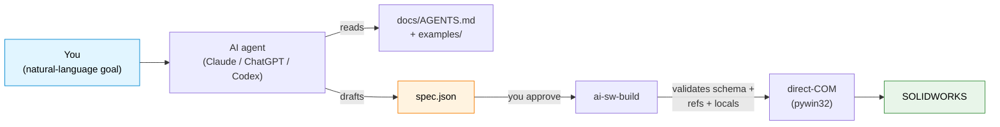

# ai-sw-bridge

> **Drive SOLIDWORKS from an AI assistant.** Hand Claude / ChatGPT / Codex a part to build and let it generate, validate, and run the JSON spec — without ever giving it a "do anything" button into your CAD model.

[](https://github.com/Thomas-Tai/ai-sw-bridge/actions/workflows/ci.yml)
[](pyproject.toml)
[](LICENSE)
[](#prerequisites)

**Language**: English · [繁體中文](docs/i18n/zh-TW/README.md) · [简体中文](docs/i18n/zh-CN/README.md)

<!--
HERO ASSETS — TO RECORD AND PASTE LATER:

  1. Animated GIF (10-15 seconds):
       Side-by-side: PowerShell terminal running
         `ai-sw-build examples/motor_mount_plate/spec.json --no-dim`
       and SOLIDWORKS window showing the part materialise feature-by-feature.
       Suggested tool: ScreenToGif (free, Windows).
       Save as: assets/hero_mmp_build.gif
       Then replace this comment with:
         

  2. Static screenshot fallback (if the GIF is heavy):
       Final-state SW window with the completed MMP part visible.
       Save as: assets/hero_mmp_static.png
-->

## What this is

A bridge between AI agents and SOLIDWORKS. You describe a part in natural language; the agent emits a JSON spec; the bridge drives SW via the COM API to build it. Every mutation is **propose → approve → execute** — the AI never touches your CAD model without your green light.



The spec language covers **16 part-modelling primitives** today (5 sketch + 5 extrude/revolve + 3 modify + 3 pattern). [See the full primitive list →](docs/spec_reference.md)

As of **v0.13**, the same tool surface is also reachable via the MCP server (`ai-sw-mcp`) — bring your own Claude Desktop, Cursor, or Continue.dev. [Jump to the MCP section ↓](#mcp-server--drive-the-bridge-from-claude-desktop--cursor--etc)

## 5-minute quickstart

### Prerequisites

- **Windows** — SOLIDWORKS is Windows-only, and the bridge uses `pywin32`.
- **SOLIDWORKS installed and running** — tested on 2024 SP1; works on 2021 SP5+.
- **Python 3.10+** — tested on 3.10, 3.12, 3.14.

### 1. Install (~2 minutes)

```powershell
git clone https://github.com/Thomas-Tai/ai-sw-bridge.git
cd ai-sw-bridge
python -m venv .venv
.venv\Scripts\activate
pip install -e .
```

### 2. Smoke test (~10 seconds)

Open SOLIDWORKS (a blank state is fine), then:

```powershell
ai-sw-probe                                              # confirms COM is alive
ai-sw-build examples/filleted_box/spec.json --no-dim     # builds a 20x20x10 box with one fillet
```

If a small filleted box appears in SW within ~3 seconds, the bridge works.

### 3. Hand the keys to your AI assistant

Open Claude / ChatGPT / Codex and paste:

> I'm using **ai-sw-bridge** — a bridge that lets AI assistants drive SOLIDWORKS via the COM API. Before doing anything, read **[`docs/AGENTS.md`](docs/AGENTS.md)** — it tells you the rules, the spec format, which example to copy, and what needs my confirmation before running.
>
> My goal: *describe your part here — e.g. "build a 40 × 30 × 10 mm plate with four Ø5 mm through-holes at the corners, 5 mm in from each edge."*
>
> Propose a JSON spec for me to review before running `ai-sw-build`.

The agent will read [`docs/AGENTS.md`](docs/AGENTS.md), pick the closest [`examples/`](examples/) match, draft a spec, and **stop** for your review. You approve, run the command yourself, and watch the part build. That's the whole loop.

**Stuck?** Try [`examples/README.md`](examples/README.md) (15 working specs, grouped by primitive) or [`docs/known_limitations.md`](docs/known_limitations.md) (sharp edges new users hit).

## Why an AI engineer should care

CAD automation has been a decade-long graveyard of fluent builder APIs and add-in frameworks (angelsix, xCAD, codestack, pyswx, pySldWrap). None of them solved the AI authoring problem — they all assume a *human* writes VBA or chains `.box().hole()` calls. AI agents don't think that way.

What's different here:

1. **JSON is the AI-native surface.** The spec is pure data, validated against a schema, validated against the locals file, validated against feature topology — *before* any SW call fires. The AI is good at data; the bridge is good at making sure the data is correct.
2. **Late-binding pywin32 works for the boring 95%.** Phase 0 proved that direct-COM dispatch covers the part-modelling API surface we need. The handful of methods that don't marshal (e.g. `SelectByID2`'s `Callout` OUT-param) have documented workarounds. [See the gotchas →](docs/known_gotchas.md)
3. **Safety is structural, not aspirational.** `ai-sw-mutate` ships a literal `propose → dry-run → review → commit` state machine. Rollback verification reads the file back from disk and compares. There is no `--yolo` flag.
4. **CHM is the source of truth for API signatures.** When a call returns `PARAMNOTOPTIONAL`, we don't guess — we re-extract from `sldworksapi.chm` and assert the arg count at runtime. [See the API reference →](docs/api_reference.md)

For the longer story (field survey of existing tools, why fluent APIs lose, why JSON wins), read [`docs/ai_driven_architecture_review.md`](docs/ai_driven_architecture_review.md).

## What ships in the box

**21 CLI commands + one MCP server** on your PATH after `pip install -e ".[mcp]"`.
Each command declares a stability **tier** (`stable` / `experimental` / `deprecated`),
printed in its `--help` banner and enforced by `tests/test_cli_stability.py`. The
authoritative tier-per-command list + the SemVer promise live in
[`docs/PUBLIC_API.md`](docs/PUBLIC_API.md) — that file is the supported-surface
contract; this table is the friendly tour.

Every mutating command follows the same **propose → approve → execute** state
machine: the AI never changes a model without an explicit human / `--yes` gate.
There is no `--yolo` flag.

| Command | Tier | What it does | Read-only? |
|---|---|---|---|
| `ai-sw-probe` | experimental | COM connectivity check — confirms SW is reachable via `GetActiveObject` | ✅ |
| `ai-sw-observe` | stable | Inspect doc / features / equations / mates / bbox / volume / custom-props / screenshots / add-ins / MBD-PMI — JSON output | ✅ |
| `ai-sw-mutate` | stable | Propose → dry-run → commit (or undo) `*_locals.txt` variable changes. Subcommands: `propose` / `dry_run` / `commit` / `undo`. Proposals persist to `./proposals/` (override via `AI_SW_BRIDGE_PROPOSALS`). | ⚠️ approval-gated |
| `ai-sw-batch` | experimental | Human-gated batch feature-commit. Executes a multi-feature plan (from MCP `sw_batch_plan`) behind a `[y/N]` gate; greens persist, fail-fast on the first fault. | ⚠️ approval-gated |
| `ai-sw-assembly` | stable | Propose-Approve-Execute assembly lifecycle (components + mates). Subcommands: `propose` / `dry_run` / `commit`. CLI-only, never MCP. | ⚠️ approval-gated |
| `ai-sw-drawing` | stable | Propose-Approve-Execute drawing lifecycle (views + annotations). Subcommands: `propose` / `dry_run` / `commit`. CLI-only, never MCP. | ⚠️ approval-gated |
| `ai-sw-properties` | stable | Propose-Approve-Execute custom-properties lifecycle. Subcommands: `propose` / `dry_run` / `commit`. CLI-only, never MCP. | ⚠️ approval-gated |
| `ai-sw-configurations` | stable | Multifile variant materialization. Subcommands: `propose` / `materialize`. Deep-merges variants over a base spec, builds each as a separate `.sldprt`. | — |
| `ai-sw-sketch-relations` | experimental | Propose-Approve-Execute sketch geometric relations (constraints). Subcommands: `propose` / `dry_run` / `commit`. CLI-only. | ⚠️ approval-gated |
| `ai-sw-sketch-edit` | experimental | Propose-Approve-Execute sketch editing ops (Convert / Offset / Trim / Pattern). Subcommands: `propose` / `dry_run` / `commit`. CLI-only. | ⚠️ approval-gated |
| `ai-sw-codegen` | experimental | Parameterize a recorded `.swp` macro against a locals file | — |
| `ai-sw-build` | stable | **Build a part from a JSON spec via direct-COM.** Three modes (`--no-dim`, `--deferred-dim`, parametric default). Validation: `--validate-only`, `--dry-run`, `--lint`. Reliability: `--checkpoint[-encrypt]`, `--auto-retry`, `--reconnect`, `--verify-mass`. Output: `--save-as`, `--save-format`. Environment: `--disable-addins`/`--strict-addins`, `--enable-flag`/`--disable-flag`, `--log-level`/`--verbose`/`--quiet`, `--locale`. Run `ai-sw-build --help` for the canonical list. | — |
| `ai-sw-history` | experimental | Query L4 checkpoint history — `part` / `since` / `diff` / `rollback` subcommands | ⚠️ rollback writes |
| `ai-sw-apidoc` | experimental | RAG over the SOLIDWORKS API CHM corpus — `search` / `detail` / `members` / `examples` / `enum` subcommands. First run after a fresh clone: `python tools/build_api_index.py` to materialize the committed index. | ✅ |
| `ai-sw-memory` | experimental | **Design-Memory RAG** — semantic search over *your own* design history (past proposals/checkpoints). `build` (backfill the local index) / `search` / `stats`. Embeddings are computed **on-device**; the index is a private, gitignored artifact. | ✅ |
| `ai-sw-checkpoint` | experimental | Manage L4 encryption — `info` (no key needed) / `genkey` / `rekey` / `migrate` | — |
| `ai-sw-import` | experimental | Foreign-geometry import (STEP / IGES → `.sldprt`) with import diagnostics. Options: `--source`, `--output`, `--dry-run`, `--verify-volume`. | — |
| `ai-sw-export-dxf-flat` | experimental | Sheet-metal flat-pattern DXF export (`export` subcommand) — exports via `ExportToDWG2`, verifies entity count. | — |
| `ai-sw-motion` | experimental | Dynamic kinematic verification (`audit`) — drives a mate through its DOF, reports interference / clearance per step. | — |
| `ai-sw-solver` | experimental | Autonomous clearance solver (`resolve-clearance`) — drives a distance mate until clash-free, reverts on failure. | ⚠️ approval-gated |
| `ai-sw-urdf` | experimental | URDF export (assembly → ROS robot model). `export` writes `.urdf` + per-component STL meshes. No SW mutation. | ✅ |
| `ai-sw-mcp` | daemon | **MCP server (stdio transport)** for Claude Desktop, Cursor, Continue.dev, and other MCP-capable clients. Exposes 37 tools (read lanes + plan/elicit-gated writes). Install with `pip install ai-sw-bridge[mcp]`. | mixed |

Three build modes for `ai-sw-build` (use `--no-dim` for AI workflows; the others trade speed for live equation links). [Why `--no-dim` exists →](docs/why_no_addim2.md)

### Feature kinds you can add (36)

Beyond the base part, `ai-sw-build` / `ai-sw-batch` (and `sw_batch_plan` over MCP)
can add these **36 seat-proven** `feature_add` kinds to a model. Each is verified by
its geometric *effect* (volume / face / area / arc-length / ratio delta), never by a
bare "no error". The live source of truth is `client.features.list_kinds()`; kinds
that are walled out-of-process are listed in [`docs/DEFERRED.md`](docs/DEFERRED.md).

| Group | Kinds |
|---|---|
| Dress-up | `fillet_constant_radius`, `fillet_face`, `variable_radius_fillet`, `chamfer`, `shell`, `draft` |
| Patterns | `linear_pattern`, `circular_pattern`, `mirror_feature`, `sketch_driven_pattern` |
| Reference geometry | `ref_plane`, `ref_axis`, `ref_point`, `coordinate_system`, `bounding_box`, `com_point`, `mate_reference` |
| Curves | `composite`, `helix`, `spiral`, `project_curve`, `curve_through_xyz` |
| Surfaces | `planar_surface`, `offset_surface`, `knit` |
| Sheet metal | `base_flange`, `hem`, `sketched_bend` |
| Sweeps & shapes | `sweep`, `sweep_cut`, `dome`, `wizard_hole` |
| Bodies & boolean | `delete_body`, `intersect`, `scale` |
| Weldment | `structural_weldment` |

```python
from ai_sw_bridge.client import SolidWorksClient
SolidWorksClient().features.list_kinds()   # -> the 36 kinds above, sorted
SolidWorksClient().features.supports("helix")   # -> True
```

### Environment variables

| Variable | Default | What it controls |
|---|---|---|
| `AI_SW_BRIDGE_CAPTURES` | `./captures` | Where `sw_screenshot` writes PNGs |
| `AI_SW_BRIDGE_PROPOSALS` | `./proposals` | Where `ai-sw-mutate` proposal JSON files persist |
| `AI_SW_BRIDGE_FLAG_<NAME>` | unset | Override a feature flag (e.g. `AI_SW_BRIDGE_FLAG_BREP_INTERROGATION=1`). CLI `--enable-flag`/`--disable-flag` wins over the env var. |
| `NO_COLOR` | unset | Strips ANSI from stderr output (honored by `PlainFormatter`) |

`--checkpoint-encrypt env:NAME` reads the Fernet key from `$NAME` at build time; the variable name is your choice.

## MCP server — drive the bridge from Claude Desktop / Cursor / etc.

The MCP server (new in v0.13) exposes 37 tools to MCP-capable AI clients
over stdio. Same observation + planning surface as the CLI; just a different
transport. The tool set is pinned by name and payload shape in
`tests/mcp_lane/test_server_contract.py` (`EXPECTED_TOOLS`) — that test is the
contract, so any add/remove/rename fails CI loudly.


### Quick install

```powershell
pip install -e ".[mcp]"   # adds the `mcp` SDK dependency
where ai-sw-mcp           # confirms the entry point is on PATH
```

### Register with Claude Desktop

Edit `%APPDATA%\Claude\claude_desktop_config.json` (path varies for the
Windows Store / MSIX build — see [`docs/mcp_server_design.md`](docs/mcp_server_design.md)):

```json
{
  "mcpServers": {
    "ai-sw-bridge": {
      "command": "C:\\path\\to\\ai-sw-mcp.exe"
    }
  }
}
```

Restart Claude Desktop fully. The MCP server appears under
**Settings → Connectors / Local MCP servers** with 37 tools listed.
Type "What's the bounding box of the active part?" in chat; the model
selects `sw_bbox`, the result renders in the chat.

### Tool inventory (37 tools)

**Observation (22)** — read-only, mirror `ai-sw-observe`:
`sw_active_doc`, `sw_feature_errors`, `sw_equations`, `sw_bbox`,
`sw_volume`, `sw_screenshot`, `sw_measure`, `sw_measure_selection`,
`sw_mate_errors`, `sw_custom_props`, `sw_enabled_addins`, `sw_interference`,
`sw_bounding_box`, `sw_inertia`, `sw_clearance`, `sw_draft_analysis`,
`sw_current_selection`, `sw_undercut_faces`, `sw_min_wall_thickness`,
`sw_feature_statistics`, `sw_analyze_stackup`, `sw_observe_mbd`

**Build + batch (3)**:
`sw_build` (validate → **elicit human approval in-chat** → build — full
`ai-sw-build` surface incl. checkpoint + encryption; no build or `save_as`
without an explicit approval, degrades to the `ai-sw-build` CLI when the client
can't elicit); `sw_batch_plan` (**hard-wired `dry_run=True`** — validates a
multi-feature batch on the live kernel but can never persist to disk);
`sw_batch_execute` (PLAN → **elicit human approval in-chat** → COMMIT, degrades
to the `ai-sw-batch` CLI). The two write tools both gate their disk write behind
MCP elicitation — no autonomous writes.

**API doc (5)** — read-only, SQLite-backed, mirror `ai-sw-apidoc`:
`sw_apidoc_search`, `sw_apidoc_detail`, `sw_apidoc_members`,
`sw_apidoc_examples`, `sw_apidoc_enum`

**Design-Memory (1)** — read-only, on-device `sqlite-vec`, mirrors `ai-sw-memory`:
`sw_retrieve_design_memory` (semantic retrieval over the operator's own past
designs; `kind` / `recipe_kind` metadata filters)

**History + checkpoint info (4)** — read-only, mirror `ai-sw-history` + `ai-sw-checkpoint info`:
`sw_history_part`, `sw_history_since`, `sw_history_diff`, `sw_checkpoint_info`

**Resilience + lifecycle (2)** — read-only health + STA reconnect:
`sw_session_health` (seat presence + durable transaction-ledger audit + last
recovery → a degraded/recovered/healthy verdict); `sw_reconnect` (re-attach
after SW process death)

**Deliberately NOT exposed via MCP** (CLI-only per [`docs/mcp_server_design.md`](docs/mcp_server_design.md) §6.5): the four mutate operations — `sw_propose_local_change`, `sw_dry_run`, `sw_commit`, `sw_undo_last_commit` — require human approval per call. `sw_checkpoint_genkey` / `sw_checkpoint_rekey` / `sw_checkpoint_migrate` are key-management operations. `sw_codegen` and `sw_probe` are not request/response shaped. The batch *commit* still requires a human: `sw_batch_execute` collects the `[y/N]` via in-chat elicitation, and `sw_batch_plan` is plan-only by construction.

[Full MCP server design + protocol detail →](docs/mcp_server_design.md)

## Limitations you should know before adopting

A short list. The [full known-limitations doc](docs/known_limitations.md) is required reading before authoring your own spec.

- **Windows only.** Non-negotiable — `pywin32` only runs on Windows.
- **`AddDimension2` opens a blocking popup in parametric mode.** Cannot be suppressed via any user preference toggle we've tried on SW 2024 SP1. Workaround: `--no-dim` mode skips the call entirely (geometry at literal target size, no equation link); `--deferred-dim` batches the popups at the end. AI-driven flows should default to `--no-dim`.
- **Face-sketch origin is the part-origin projection, not the face centroid.** A `center` offset on a face sketch resolves relative to where SW projects (0,0,0) onto the face, not to the visual face center. Bites everyone once. Documented.
- **Some advanced features are walled out-of-process.** A handful of feature kinds (e.g. `loft`, `combine`, `split`, `wrap`, the profile-sketch sheet-metal flanges) cannot be materialized through the COM boundary and are registered `DORMANT`/`WALLED` — they fail loud rather than silently no-op. See [`docs/DEFERRED.md`](docs/DEFERRED.md) for the kernel-wall classification.
- **No "describe the part in English and get geometry" for free.** The spec language is precise; the AI generates spec JSON, not freehand prose. The natural-language step happens in your chat with the agent, before the spec is drafted.

## Project status

**Current release: `v1.6.0` — commercial, Production/Stable.** One public Python
entry point (`SolidWorksClient`), 21 CLI commands, a 37-tool MCP server, and a
36-kind `feature_add` registry behind the `ai-sw-batch` / `ai-sw-mutate` surface.
Validated against SOLIDWORKS 32.1.0 (2024 SP1); CI green on Win-2025 × Python
3.10 / 3.12 / 3.14. The offline suite is **3,700+ tests**, plus a live-SW
end-to-end lane (`solidworks_only`) and a destructive seat-death recovery lane
(`destructive_sw`).

Milestone arc (full detail in [CHANGELOG.md](CHANGELOG.md)):

- **v0.1–v0.3 — foundations.** `probe` / `observe` / `mutate` / Path C `codegen`;
  the JSON-spec builder (Motor Mount Plate, three build modes); first primitives.
- **v0.10–v0.13 — reliability & intelligence.** Feature flags, circuit breaker,
  SLI baselines, two-stream contract, CLI stability tiers; B-rep interrogation,
  the COM error envelope, RAG API-doc retrieval, L4 SQLite checkpoints + at-rest
  Fernet encryption; the `ai-sw-mcp` server + STA-threaded `ComExecutor`.
- **v0.14–v0.18 — capability epochs.** Assemblies & mates, drawings & annotations,
  custom properties, multifile configurations, sketch editing, surfaces,
  sheet-metal, curves, reference geometry, weldments — and the consolidation to a
  single `SolidWorksClient` facade (the free `sw_*` functions removed).
- **v1.0.0 — GA** (2026-06-23). First stable release; the `SolidWorksClient` facade
  is the sole supported Python API, SemVer in force.
- **v1.1–v1.4 — agentic batch & observability.** Transactional multi-feature
  `client.mutate.batch()` + `sw_batch_plan` / `sw_batch_execute`; the `intersect`
  lane; MBD/DimXpert PMI observability (`sw_observe_mbd`).
- **v1.5.0 — runtime resilience & design intelligence.** The `SupervisedSession`
  crash-recovery envelope (detect → respawn → idempotent replay, live-proven on a
  real seat) and a local, on-device Design-Memory RAG (`ai-sw-memory`).
- **v1.6.0 — self-healing batch + unified write-gate** (2026-06-26). Supervised
  recovery is the **default** batch path; **both** MCP write tools (`sw_build`,
  `sw_batch_execute`) gate every disk write behind in-chat human approval (MCP
  elicitation); proprietary commercial licensing; CI hardened (black / flake8 /
  mypy / import-linter / coverage / secret + CVE scanning, all blocking).

See [`docs/PUBLIC_API.md`](docs/PUBLIC_API.md) for the supported-surface contract
and [`docs/human_gates_runbook.md`](docs/human_gates_runbook.md) for the release /
live-proof checklist.

## Layout

```
ai-sw-bridge/
├── src/ai_sw_bridge/         # the bridge itself
│   ├── spec/                 #   JSON spec → direct-COM builder
│   │   ├── builder.py        #     build loop + non-sketch handlers + registry
│   │   ├── sketches/         #     SketchHandler ABC + 5 concrete handlers
│   │   └── ...
│   ├── brep/                 # L1 — B-rep interrogation (per-feature manifest)
│   ├── errors/               # L2 — build_error / wrapper / hints / circuit_breaker / auto_retry
│   ├── rag/                  # L3 — API RAG (sqlite-vec index + embedder)
│   ├── checkpoint/           # L4 — SQLite checkpoints (store / snapshot / rollback / crypto)
│   ├── com/                  #     ComExecutor + adapter factory (STA-thread COM safety)
│   ├── mcp/                  # Lane M — MCP server (FastMCP + @com_tool decorator)
│   ├── telemetry/            # local SQLite metrics + trace IDs (no PII / no auto-upload)
│   ├── flags/                # feature-flag registry + precedence resolver
│   └── cli/                  # 21 CLI entry points (tiered in cli/stability.py)
├── examples/                 # worked specs (start here when authoring)
├── docs/
│   ├── AGENTS.md             #   agent briefing — what the AI reads first
│   ├── spec_reference.md     #   per-primitive schema reference
│   ├── api_reference.md      #   CHM-verified SW API surface
│   ├── known_limitations.md  #   sharp edges + workarounds
│   ├── known_gotchas.md      #   things we learned the hard way
│   ├── DEFERRED.md           # ← v0.14+ backlog + indefinitely-deferred items
│   ├── ROADMAP.md
│   ├── mcp_server_design.md  # ← MCP server protocol + tool inventory + design rationale
│   ├── checkpoint_encryption_design.md  # ← L4 at-rest encryption (Fernet, 4 key sources)
│   └── ai_driven_architecture_review.md  # field survey + design rationale
├── tools/                    # CHM extractor, drift/license lint, bundle, perf baselines, probe_mcp_tools, checkpoint_redact, spec_redact, example_roundtrip
├── spikes/                   # Phase 0 / v0.3 / v0.5 / v0.6 API probes
├── tests/                    # 3,750 offline tests, green on Python 3.10 / 3.12 / 3.14
│   ├── e2e_sw/               # end-to-end suite against live SW (solidworks_only marker)
│   ├── fault_injection/      # COM HRESULT injection (separate CI job)
│   ├── mcp_lane/             # MCP server contract + wire-level + snapshot fixtures
│   └── onboarding/           # quickstart smoke (no-SW-required)
├── CODESTYLE.md              # cross-cutting code discipline (two-stream, fail-soft, STA, etc.)
└── CONTRIBUTING.md           # developer workflow + per-file port attribution
```

## License

Commercial / proprietary — see [LICENSE](LICENSE) (a counsel-review template as
of v1.5.0). Releases v1.0.0–v1.4.0 were published under the MIT License and
remain available under those terms. Incorporated third-party components keep
their own licenses — see [THIRD-PARTY-NOTICES.md](THIRD-PARTY-NOTICES.md).
Contributions are accepted under the [CLA](CLA.md).

## Acknowledgments

SOLIDWORKS API patterns: [CodeStack](https://www.codestack.net/solidworks-api/). The Path C dim-binding fix (`EquationMgr.Add2` 3-arg form) came from their `document/dimensions/add-equation/` example.

Includes adapted code from [SolidworksMCP-python](https://github.com/andrewbartels1/SolidworksMCP-python) (MIT, ESPO Corporation 2025); see [THIRD-PARTY-NOTICES.md](THIRD-PARTY-NOTICES.md).
