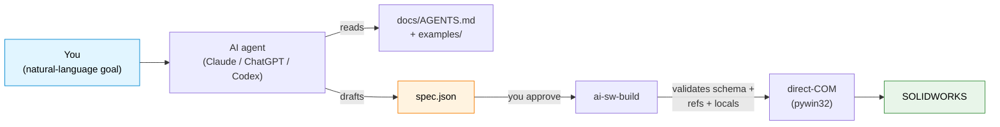

# ai-sw-bridge

> **Drive SOLIDWORKS from an AI assistant.** Hand Claude / ChatGPT / Codex a part to build and let it generate, validate, and run the JSON spec — without ever giving it a "do anything" button into your CAD model.

[](https://github.com/Thomas-Tai/ai-sw-bridge/actions/workflows/ci.yml)
[](pyproject.toml)
[](LICENSE)
[](#prerequisites)

**Language**: English · [繁體中文](docs/i18n/zh-TW/README.md) · [简体中文](docs/i18n/zh-CN/README.md)

<!--
HERO ASSETS — TO RECORD AND PASTE LATER:

  1. Animated GIF (10-15 seconds):
       Side-by-side: PowerShell terminal running
         `ai-sw-build examples/motor_mount_plate/spec.json --no-dim`
       and SOLIDWORKS window showing the part materialise feature-by-feature.
       Suggested tool: ScreenToGif (free, Windows).
       Save as: assets/hero_mmp_build.gif
       Then replace this comment with:
         

  2. Static screenshot fallback (if the GIF is heavy):
       Final-state SW window with the completed MMP part visible.
       Save as: assets/hero_mmp_static.png
-->

## What this is

A bridge between AI agents and SOLIDWORKS. You describe a part in natural language; the agent emits a JSON spec; the bridge drives SW via the COM API to build it. Every mutation is **propose → approve → execute** — the AI never touches your CAD model without your green light.



The spec language covers **12 part-modelling primitives** today (sketches, extrudes, cuts, fillets, chamfers, patterns, mirror, revolve, holes). [See the full primitive list →](docs/spec_reference.md)

## 5-minute quickstart

### Prerequisites

- **Windows** — SOLIDWORKS is Windows-only, and the bridge uses `pywin32`.
- **SOLIDWORKS installed and running** — tested on 2024 SP1; works on 2021 SP5+.
- **Python 3.10+** — tested on 3.10, 3.12, 3.14.

### 1. Install (~2 minutes)

```powershell
git clone https://github.com/Thomas-Tai/ai-sw-bridge.git
cd ai-sw-bridge
python -m venv .venv
.venv\Scripts\activate
pip install -e .
```

### 2. Smoke test (~10 seconds)

Open SOLIDWORKS (a blank state is fine), then:

```powershell
ai-sw-probe                                              # confirms COM is alive
ai-sw-build examples/filleted_box/spec.json --no-dim     # builds a 20x20x10 box with one fillet
```

If a small filleted box appears in SW within ~3 seconds, the bridge works.

### 3. Hand the keys to your AI assistant

Open Claude / ChatGPT / Codex and paste:

> I'm using **ai-sw-bridge** — a bridge that lets AI assistants drive SOLIDWORKS via the COM API. Before doing anything, read **[`docs/AGENTS.md`](docs/AGENTS.md)** — it tells you the rules, the spec format, which example to copy, and what needs my confirmation before running.
>
> My goal: *describe your part here — e.g. "build a 40 × 30 × 10 mm plate with four Ø5 mm through-holes at the corners, 5 mm in from each edge."*
>
> Propose a JSON spec for me to review before running `ai-sw-build`.

The agent will read [`docs/AGENTS.md`](docs/AGENTS.md), pick the closest [`examples/`](examples/) match, draft a spec, and **stop** for your review. You approve, run the command yourself, and watch the part build. That's the whole loop.

**Stuck?** Try [`examples/README.md`](examples/README.md) (12 working specs, grouped by primitive) or [`docs/known_limitations.md`](docs/known_limitations.md) (sharp edges new users hit).

## Why an AI engineer should care

CAD automation has been a decade-long graveyard of fluent builder APIs and add-in frameworks (angelsix, xCAD, codestack, pyswx, pySldWrap). None of them solved the AI authoring problem — they all assume a *human* writes VBA or chains `.box().hole()` calls. AI agents don't think that way.

What's different here:

1. **JSON is the AI-native surface.** The spec is pure data, validated against a schema, validated against the locals file, validated against feature topology — *before* any SW call fires. The AI is good at data; the bridge is good at making sure the data is correct.
2. **Late-binding pywin32 works for the boring 95%.** Phase 0 proved that direct-COM dispatch covers the part-modelling API surface we need. The handful of methods that don't marshal (e.g. `SelectByID2`'s `Callout` OUT-param) have documented workarounds. [See the gotchas →](docs/known_gotchas.md)
3. **Safety is structural, not aspirational.** `ai-sw-mutate` ships a literal `propose → dry-run → review → commit` state machine. Rollback verification reads the file back from disk and compares. There is no `--yolo` flag.
4. **CHM is the source of truth for API signatures.** When a call returns `PARAMNOTOPTIONAL`, we don't guess — we re-extract from `sldworksapi.chm` and assert the arg count at runtime. [See the API reference →](docs/api_reference.md)

For the longer story (field survey of existing tools, why fluent APIs lose, why JSON wins), read [`docs/ai_driven_architecture_review.md`](docs/ai_driven_architecture_review.md).

## What ships in the box

Five CLI commands on your PATH after `pip install -e .`:

| Command | What it does | Read-only? |
|---|---|---|
| `ai-sw-probe` | COM connectivity check | ✅ |
| `ai-sw-observe` | Inspect features, equations, mates, screenshots — JSON output | ✅ |
| `ai-sw-mutate` | Propose → dry-run → commit changes to `*_locals.txt` variables | ⚠️ approval-gated |
| `ai-sw-codegen` | Parameterize a recorded `.swp` macro against a locals file | — |
| `ai-sw-build` | **Build a part from a JSON spec via direct-COM** ← the v0.2 path | — |

Three build modes for `ai-sw-build` (use `--no-dim` for AI workflows; the others trade speed for live equation links). [Why `--no-dim` exists →](docs/why_no_addim2.md)

## Limitations you should know before adopting

A short list. The [full known-limitations doc](docs/known_limitations.md) is required reading before authoring your own spec.

- **Windows only.** Non-negotiable — `pywin32` only runs on Windows.
- **`AddDimension2` opens a blocking popup in parametric mode.** Cannot be suppressed via any user preference toggle we've tried on SW 2024 SP1. Workaround: `--no-dim` mode skips the call entirely (geometry at literal target size, no equation link); `--deferred-dim` batches the popups at the end. AI-driven flows should default to `--no-dim`.
- **Face-sketch origin is the part-origin projection, not the face centroid.** A `center` offset on a face sketch resolves relative to where SW projects (0,0,0) onto the face, not to the visual face center. Bites everyone once. Documented.
- **No assemblies, no mates, no drawings.** Part-level workflows only.
- **No "describe the part in English and get geometry" for free.** The spec language is precise; the AI generates spec JSON, not freehand prose. The natural-language step happens in your chat with the agent, before the spec is drafted.

## Project status

- **v0.1 — production-validated** on SOLIDWORKS 2024 SP1. `probe` / `observe` / `mutate` / Path C `codegen` all working.
- **v0.2 (JSON-spec builder) — Phase 1 GREEN.** Motor Mount Plate builds 10/10 features with 7 parametric bindings, in all three modes. Rectangle equation-link demotion fixed 2026-05-20 (Spike ZF).
- **v0.3 — primitives shipped:** chamfer, linear pattern, mirror, revolve, simple hole.
- **v0.10 — reliability + DX bundle GREEN.** `--lint`, `--verify-mass`, `_expect`, structured logging, `build_metrics.json`, pre-commit framework, doc-coverage gate, golden-volume regression check, SW version floor.
- **v0.11 — reliability / observability / supply-chain GREEN** (2026-05-27). 15-lane Phase 1: feature flags, circuit breaker, SLI baselines (p50/p95/p99), local telemetry SQLite, license-lint, upstream-drift, AGENTS.md drift, quickstart smoke, CLI stability tiers, bug-report bundler, two-stream contract, COM reconnect, fault-injection harness, release-engineering CI, anti-loop retry guard. Validated against SW 32.1.0; 342/342 tests pass; CI green on Win-2025 × Py 3.10/3.12/3.14.
- **v0.12 — four capability lanes GREEN** (2026-05-27). 27-task Phase 2 across E1–E6: **L1 B-rep interrogation** (per-feature topological fingerprint manifest), **L2 COM error envelope + 9-entry hint catalog with hint-aware RetryGuard**, **L3 RAG API-doc retrieval** (committed 262-chunk index + `ai-sw-apidoc` CLI with 5 subcommands), **L4 SQLite per-feature checkpoints + `ai-sw-history` CLI**. All lanes behind default-OFF flags — every v0.11 spec builds byte-identical. 647/647 tests pass. [See CHANGELOG →](CHANGELOG.md) · [migration notes →](docs/migration_to_v0.12.md) · [ROADMAP →](docs/ROADMAP.md)

## Layout

```
ai-sw-bridge/
├── src/ai_sw_bridge/         # the bridge itself
│   ├── spec/                 #   JSON spec → direct-COM builder
│   │   ├── builder.py        #     build loop + non-sketch handlers + registry
│   │   ├── sketches/         #     SketchHandler ABC + 5 concrete handlers
│   │   └── ...
│   └── cli/                  #   five CLI entry points
├── examples/                 # 12 worked specs (start here when authoring)
├── docs/
│   ├── AGENTS.md             #   agent briefing — what the AI reads first
│   ├── spec_reference.md     #   per-primitive schema reference
│   ├── api_reference.md      #   CHM-verified SW API surface
│   ├── known_limitations.md  #   sharp edges + workarounds
│   ├── known_gotchas.md      #   things we learned the hard way
│   └── ai_driven_architecture_review.md  # field survey + v0.2 design
├── tools/                    # CHM extractor, drift/license lint, bundle, perf baselines
├── spikes/                   # Phase 0 / v0.3 / v0.5 / v0.6 API probes
└── tests/                    # 342 tests, all green on Python 3.10 / 3.12 / 3.14
```

## License

MIT. See [LICENSE](LICENSE).

## Acknowledgments

SOLIDWORKS API patterns: [CodeStack](https://www.codestack.net/solidworks-api/). The Path C dim-binding fix (`EquationMgr.Add2` 3-arg form) came from their `document/dimensions/add-equation/` example.

Includes adapted code from [SolidworksMCP-python](https://github.com/andrewbartels1/SolidworksMCP-python) (MIT, ESPO Corporation 2025).
