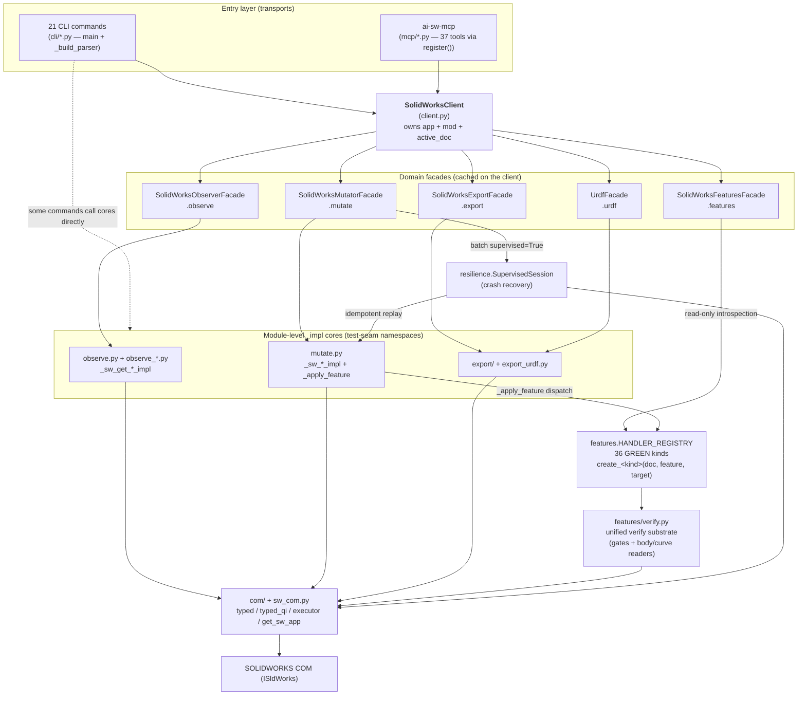
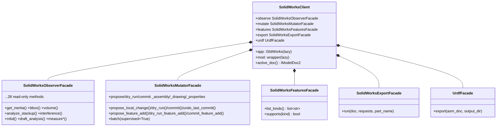
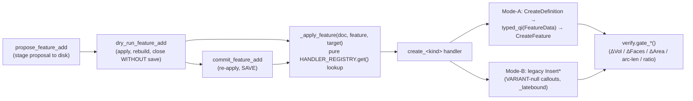
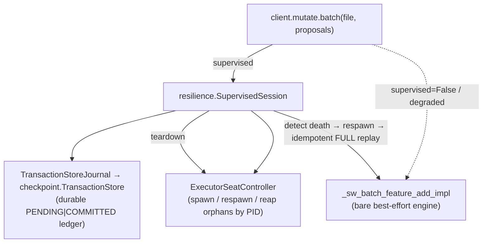

# Class & Function Relation Map

> **Generated:** 2026-06-26 · **Release:** v1.7.0
>
> A navigational map of how the codebase fits together: the public class API, the
> facades and the `_impl` cores they delegate to, the feature-handler registry, the
> resilience envelope, and the COM substrate — plus the enforced layer hierarchy.
> This is a companion to [`PUBLIC_API.md`](PUBLIC_API.md) (the *contract*); this file
> is the *structure*.

---

## 1. The big picture



**Reading it:** transports (CLI, MCP) talk to one stateful `SolidWorksClient`. The
client owns the COM connection and exposes five **facades**. Each facade is a thin,
namespaced view that delegates to **module-level `_impl` cores** — kept at module
level on purpose (tests monkeypatch COM seams on those namespaces). Writes flow
`mutate → _apply_feature → HANDLER_REGISTRY → verify`, optionally wrapped by the
**resilience** envelope. Everything bottoms out in the **COM substrate**.

---

## 2. The public class API (`client.py`)

`SolidWorksClient` is the v1.0 commercial boundary: a single stateful owner of the
connection, with lazily-acquired `app` (the `ISldWorks` pointer) and `mod` (the
makepy wrapper module), both injectable for tests / pre-opened docs.

| Facade property | Class | Delegates to | Role |
|---|---|---|---|
| `.observe` | `SolidWorksObserverFacade` | `observe*.py` `_sw_get_*_impl` | Read-only inspection (28 methods) |
| `.mutate` | `SolidWorksMutatorFacade` | `mutate.py` `_sw_*_impl` | Propose→Approve→Execute writes |
| `.features` | `SolidWorksFeaturesFacade` | `features.HANDLER_REGISTRY` | Read-only kind discovery |
| `.export` | `SolidWorksExportFacade` | `export.export_all` | Multi-format export |
| `.urdf` | `UrdfFacade` | `export_urdf.export_urdf` | Assembly → ROS/URDF |



> **Legacy shims.** The historical `sw_*` free functions still exist as
> `PendingDeprecationWarning` shims routing to the same `_impl` cores, so old
> scripts keep working. Facades call the `_impl` cores directly (no warning).

---

## 3. The write path — `mutate` → registry → verify

The mutation lifecycle is **Propose → Approve → Execute**; the AI never persists a
model change without a human/`--yes`/elicitation gate.



### 3.1 Registry (`features/__init__.py`)

- `HANDLER_REGISTRY: dict[str, Handler]` — `kind → create_<kind>(doc, feature, target) → (bool, str|None)`.
- `_register_lane(kind, handler, status)` — **the sole sanctioned entry**: registers
  iff `status == "GREEN"` (seat-proven), silently skips a recognized dormant
  sentinel (`UNFIRED`/`DEFERRED`/`WALLED`/…), and **raises** on a malformed status.
  This is the fail-loud gate that prevents an unproven/walled handler from being
  advertised.
- **36 GREEN kinds** ship; dormant lanes (`combine`, `split`, `loft`, `rib`, `wrap`,
  `boundary_boss`, `edge_flange`, `move_body`, `copy_body`, `thicken`) are imported
  for provenance + fail-loud but never advertised.

### 3.2 Mode selection (per-lane, seat-proven)

Mode is **not** a runtime switch — each handler picks its route empirically and
documents the seat-proof in the registry comment, governed by the **OOP boundary
law** (`reference_oop_boundary_law`):

- **Mode-A** materializes when the caller hands the kernel positions directly
  (closed-form offsets / explicit points): `CreateDefinition(enum) → typed_qi(
  IFeatureData) → CreateFeature`. e.g. `bounding_box`, `fillet_face`.
- **Mode-B** is the legacy generative `Insert*` route, used when no creation enum
  exists or Mode-A is quarantined on this SW build. e.g. `helix`, `composite`,
  `knit`, `structural_weldment`.

### 3.3 Verify substrate (`features/verify.py`)

The single source of truth for "did the feature actually materialize" — body/sheet
readers, feature-node counters, the curve arc-length witness, the centroid reader,
and the **class gates** (`gate_additive_solid`, `gate_fold`, `gate_surface_create`,
`gate_surface_aggregate`, `gate_volume_transform`, `gate_boolean_intersect`,
`gate_curve`, …). A `Feature`/node return *alone* is never success (the ghost-node
trap: a node appears while the geometry silently failed to materialize). Lane modules hold **thin delegating shims** (`_curve_length_mm` →
`verify.curve_length_mm`) so each lane's tests can monkeypatch on its own namespace.

---

## 4. The resilience envelope

`mutate.batch(..., supervised=True)` (the default) wraps the batch runner in a
crash-recovery session.



- **Tier-1** (open/apply death): respawn + replay from pristine.
- **Tier-2** (save death): snapshot-restore then replay.
- Degrades gracefully to the bare engine if the envelope can't be constructed.
- `sw_session_health` (MCP) reads the durable ledger for a degraded/recovered/healthy verdict.
- **Live-proven 2026-06-26** — all 5 `test_supervised_recovery.py` destructive cases pass on a real seat.

---

## 5. The COM substrate (`com/`, `sw_com.py`)

The bottom of the stack — everything else depends on it; it depends on nothing in
the package.

| Symbol | Home | Role |
|---|---|---|
| `get_sw_app()` / `get_active_doc()` | `sw_com.py` | Attach to the live seat via the ROT |
| `typed()` / `typed_qi()` | `com/earlybind.py` | Early-bind / QueryInterface casts (makepy) |
| `wrapper_module()` | `com/sw_type_info.py` | The makepy wrapper module |
| `ComExecutor` | `com/executor.py` | STA-threaded COM marshalling (MCP) |
| `_latebound()` | `com/latebound.py` | Re-wrap a typed doc for VARIANT-callout methods |
| adapters | `com/adapters/` | `mock` (offline) / `pywin32` (live) dispatch |

---

## 6. Enforced layer hierarchy (import-linter)

`pyproject.toml [tool.importlinter]` pins a **22-layer** contract — higher layers may
import lower, never the reverse:

```
cli → mcp → resilience → mutate → config → spec → parameterize → observe →
export → import_geom → drawing → features → brep → com → checkpoint → rag →
sw_com → sw_types → flags → locals_io → errors → telemetry
```

**Two blessed exceptions** (`ignore_imports`) — the intended GA architecture, not leaks:
- `client → mutate` (Facade → Transaction)
- `client → resilience` (Facade composes the supervised envelope)

CI runs `lint-imports`; the contract currently reports **0 broken**.

---

## 7. Where to start reading

| You want to… | Start at |
|---|---|
| Understand the public API | `client.py` + [`PUBLIC_API.md`](PUBLIC_API.md) |
| Add a feature kind | `features/__init__.py` (lane protocol) + an existing lane (e.g. `features/scale.py`) |
| Understand "did it work" checks | `features/verify.py` |
| Trace a CLI command | `cli/<name>.py` (`main` → `_build_parser`) |
| Trace an MCP tool | `mcp/tools.py` + `mcp/_tool_*.py` (`register`) |
| Understand crash recovery | `resilience/session.py` + `checkpoint/transaction_store.py` |
| Understand COM marshalling | `com/earlybind.py`, `com/executor.py`, `sw_com.py` |
