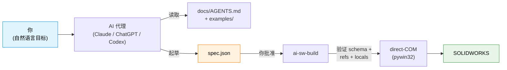

# ai-sw-bridge

> **让 AI 助手驱动 SOLIDWORKS。** 把零件交给 Claude / ChatGPT / Codex，让它生成、验证并执行 JSON 规格 — 而不需要给它一个"什么都能做"的按钮进入你的 CAD 模型。

[](https://github.com/Thomas-Tai/ai-sw-bridge/actions/workflows/ci.yml)
[](../../../pyproject.toml)
[](../../../LICENSE)
[](#前提条件)

> **Language**: [English](../../../README.md) · 简体中文

<!--
HERO ASSETS — TO RECORD AND PASTE LATER:

  1. Animated GIF (10-15 seconds):
       Side-by-side: PowerShell terminal running
         `ai-sw-build examples/motor_mount_plate/spec.json --no-dim`
       and SOLIDWORKS window showing the part materialise feature-by-feature.
       Suggested tool: ScreenToGif (free, Windows).
       Save as: assets/hero_mmp_build.gif
       Then replace this comment with:
         

  2. Static screenshot fallback (if the GIF is heavy):
       Final-state SW window with the completed MMP part visible.
       Save as: assets/hero_mmp_static.png
-->

## 这是什么

一个连接 AI 代理与 SOLIDWORKS 的桥接器。你用自然语言描述一个零件；代理产出 JSON 规格；桥接器通过 COM API 驱动 SW 来构建它。每一次变更都是 **propose → approve → execute** — AI 未经你同意绝不碰你的 CAD 模型。



规格语言目前涵盖 **12 种零件建模基本操作**（草图 (sketch)、拉伸 (extrude)、切除、圆角 (fillet)、倒角 (chamfer)、阵列 (pattern)、镜像 (mirror)、旋转 (revolve)、孔 (hole)）。[查看完整基本操作列表 →](../../spec_reference.md)

## 5 分钟快速入门

### 前提条件

- **Windows** — SOLIDWORKS 仅限 Windows，且桥接器使用 `pywin32`。
- **SOLIDWORKS 已安装且正在运行** — 在 2024 SP1 上测试过；2021 SP5+ 亦可运行。
- **Python 3.10+** — 在 3.10、3.12、3.14 上测试过。

### 1. 安装（约 2 分钟）

```powershell
git clone https://github.com/Thomas-Tai/ai-sw-bridge.git
cd ai-sw-bridge
python -m venv .venv
.venv\Scripts\activate
pip install -e .
```

### 2. 冒烟测试（约 10 秒）

打开 SOLIDWORKS（空白状态即可），然后：

```powershell
ai-sw-probe                                              # 确认 COM 连接正常
ai-sw-build examples/filleted_box/spec.json --no-dim     # 构建一个 20x20x10 带一个圆角的方盒
```

如果约 3 秒内在 SW 中出现一个带圆角的小方盒，表示桥接器运行正常。

### 3. 把钥匙交给你的 AI 助手

打开 Claude / ChatGPT / Codex 并粘贴：

> 我正在使用 **ai-sw-bridge** — 一个让 AI 助手通过 COM API 驱动 SOLIDWORKS 的桥接器。在做任何事之前，请先阅读 **[`docs/AGENTS.md`](../AGENTS.md)** — 它告诉你规则、规格格式、该复制哪个示例，以及什么需要我确认才能执行。
>
> 我的目标：*在此描述你的零件 — 例如"构建一个 40 × 30 × 10 mm 的板子，四角有四个 Ø5 mm 穿孔，距各边 5 mm。"*
>
> 请提出一份 JSON 规格供我审查，之后再执行 `ai-sw-build`。

代理会阅读 [`docs/AGENTS.md`](../AGENTS.md)，挑选最接近的 [`examples/`](../../../examples/) 匹配，起草规格，然后**停下来**等你审查。你批准后，自己执行命令，看着零件构建完成。这就是整个循环。

**卡住了？** 试试 [`examples/README.md`](../../../examples/README.md)（12 份可用规格，按基本操作分类）或 [`docs/known_limitations.md`](known_limitations.md)（新用户常踩的坑）。

## 为什么 AI 工程师应该关心

CAD 自动化过去十年是一个流畅构建器 API 与插件框架的坟场（angelsix、xCAD、codestack、pyswx、pySldWrap）。它们都没有解决 AI 编写问题 — 全都假设由*人*编写 VBA 或串接 `.box().hole()` 调用。AI 代理不是这样思考的。

这里有什么不同：

1. **JSON 是 AI 原生的界面。** 规格是纯数据，对 schema 验证、对 locals 文件验证、对特征拓扑验证 — *在任何 SW 调用触发之前*。AI 擅长数据；桥接器擅长确保数据正确。
2. **晚期绑定 (late-binding) pywin32 处理了无聊的 95%。** Phase 0 证明了 direct-COM dispatch 覆盖了我们需要的零件建模 API 接口。少数无法封送处理 (marshal) 的方法（例如 `SelectByID2` 的 `Callout` OUT 参数）有文档记录的替代方案。[查看注意事项 →](../../known_gotchas.md)
3. **安全性是结构性的，不是愿景。** `ai-sw-mutate` 提供了实实在在的 `propose → dry-run → review → commit` 状态机。回滚验证会从磁盘读回文件并比对。没有 `--yolo` 标志。
4. **CHM 是 API 签名的事实来源。** 当一个调用返回 `PARAMNOTOPTIONAL` 时，我们不猜 — 我们从 `sldworksapi.chm` 重新提取并在运行时断言参数数量。[查看 API 参考 →](../../api_reference.md)

完整故事（现有工具的领域调查、为什么流畅 API 输了、为什么 JSON 赢了），请阅读 [`docs/ai_driven_architecture_review.md`](../../ai_driven_architecture_review.md)。

## 包装盒里有什么

`pip install -e .` 后你的 PATH 上会有五个 CLI 命令：

| 命令 | 功能 | 只读？ |
|---|---|---|
| `ai-sw-probe` | COM 连接检查 | ✅ |
| `ai-sw-observe` | 检查特征、方程式、配合、截图 — JSON 输出 | ✅ |
| `ai-sw-mutate` | 对 `*_locals.txt` 变量进行 propose → dry-run → commit 变更 | ⚠️ 需批准 |
| `ai-sw-codegen` | 将录制的 `.swp` 宏针对 locals 文件进行参数化 | — |
| `ai-sw-build` | **通过 direct-COM 从 JSON 规格构建零件** ← v0.2 路线 | — |

`ai-sw-build` 的三种构建模式（AI 工作流请使用 `--no-dim`；其他模式以速度换取实时方程式链接）。[为什么 `--no-dim` 存在 →](why_no_addim2.md)

## 采用前应了解的限制

简短列表。在编写自己的规格之前，[完整已知限制文档](known_limitations.md)是必读的。

- **仅限 Windows。** 没有商量余地 — `pywin32` 只能在 Windows 上运行。
- **`AddDimension2` 在参数化模式下会打开阻塞式弹窗。** 在 SW 2024 SP1 上，无法通过任何我们尝试过的用户偏好切换来抑制。替代方案：`--no-dim` 模式完全跳过该调用（几何以字面目标尺寸构建，无方程式链接）；`--deferred-dim` 在最后批量处理弹窗。AI 驱动流程应默认使用 `--no-dim`。
- **面草图原点是零件原点投影，不是面质心。** 面草图上的 `center` 偏移量是相对于 SW 将 (0,0,0) 投影到面上的位置，而不是视觉上的面中心。每个人都会踩到一次。已记录。
- **无装配体、无配合、无工程图。** 仅限零件级工作流。
- **不是免费的"用英文描述零件就得到几何"。** 规格语言是精确的；AI 生成的是规格 JSON，不是随意文字。自然语言步骤发生在你与代理的对话中，在规格起草之前。

## 项目状态

- **v0.1 — 在 SOLIDWORKS 2024 SP1 上通过生产验证。** `probe` / `observe` / `mutate` / Path C `codegen` 全部正常运行。
- **v0.2（JSON 规格构建器）— Phase 1 GREEN。** Motor Mount Plate 以 7 个参数绑定构建 10/10 特征，三种模式全部通过。矩形方程式链接降级问题已于 2026-05-20 修复（Spike ZF）。[查看 CHANGELOG](../../../CHANGELOG.md)。
- **v0.3 — 已交付基本操作：** 倒角、线性阵列、镜像、旋转、简单孔。
- **v0.4 下一步：** 圆形阵列、变半径圆角、±x/±y 面草图。[查看 CHANGELOG →](../../../CHANGELOG.md)

## 目录结构

```
ai-sw-bridge/
├── src/ai_sw_bridge/         # 桥接器本体
│   ├── spec/                 #   JSON 规格 → direct-COM 构建器
│   │   ├── builder.py        #     构建循环 + 非草图处理器 + 注册表
│   │   ├── sketches/         #     SketchHandler ABC + 5 个具体处理器
│   │   └── ...
│   └── cli/                  #   五个 CLI 入口
├── examples/                 # 12 份可用规格（编写时从这里开始）
├── docs/
│   ├── AGENTS.md             #   代理简报 — AI 首先阅读的内容
│   ├── spec_reference.md     #   每种基本操作的 schema 参考
│   ├── api_reference.md      #   CHM 验证过的 SW API 接口
│   ├── known_limitations.md  #   坑 + 替代方案
│   ├── known_gotchas.md      #   我们辛苦学到的教训
│   └── ai_driven_architecture_review.md  # 领域调查 + v0.2 设计
├── tools/                    # CHM 提取器 + 特征树差异比对工具
├── spikes/                   # Phase 0 / v0.3 / v0.5 / v0.6 API 探测
└── tests/                    # 84 项测试，在 Python 3.10 / 3.12 / 3.14 上全部通过
```

## 许可证

MIT。详见 [LICENSE](../../../LICENSE)。

## 致谢

SOLIDWORKS API 模式：[CodeStack](https://www.codestack.net/solidworks-api/)。Path C 尺寸链接修复（`EquationMgr.Add2` 三参数形式）来自他们的 `document/dimensions/add-equation/` 示例。
