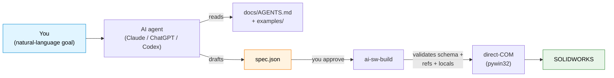

# ai-sw-bridge

> **让 AI 助手驱动 SOLIDWORKS。** 把要构建的零件交给 Claude / ChatGPT / Codex，让它生成、验证并执行 JSON 规格 — 而不需要给它一个可以在你的 CAD 模型里"为所欲为"的按钮。

[](https://github.com/Thomas-Tai/ai-sw-bridge/actions/workflows/ci.yml)
[](../../../pyproject.toml)
[](../../../LICENSE)
[](#前提条件)

**Language**: [English](../../../README.md) · [繁體中文](../zh-TW/README.md) · 简体中文

## 你是谁？→ 从这里开始

这份 README 是一个**角色路由器**。找到与你匹配的那一行，直接跳到为你写的部分 —
其余部分只是路标，不必通读。本页大部分篇幅是操作者主线；开发者与贡献者
只会看到一段简短引导和一份文档地图。

| 你是… | 你想… | 前往 |
|---|---|---|
| **操作者** — SOLIDWORKS 用户，不是程序员 | 安装桥接器，并从你的 AI 助手驱动它 | [**面向操作者 — 5 分钟快速入门**](#面向操作者--5-分钟快速入门) · 然后把 [`docs/operator_guide.md`](../../operator_guide.md) 交给你的 AI |
| **开发者 / 集成方** | 调用 `SolidWorksClient`、嵌入 MCP 服务器，或阅读受支持范围的契约 | [**面向开发者与集成方**](#面向开发者与集成方) |
| **贡献者** | 新增一种特征类型、修复一处高墙、理解整体架构 | [**面向贡献者**](#面向贡献者) |

刚接触本项目、只想让它先跑起来？从头到尾读一遍**[面向操作者](#面向操作者--5-分钟快速入门)**，
然后打开权威的 [Operator Guide](../../operator_guide.md) — 这是唯一需要交给你的 AI 助手的文件。

## 这是什么

一个连接 AI 代理与 SOLIDWORKS 的桥接器。你用自然语言描述一个零件；代理产出 JSON 规格；桥接器通过 COM API 驱动 SW 来构建它。每一次变更都遵循 **propose → approve → execute**（提议 → 批准 → 执行）— AI 未经你放行绝不会碰你的 CAD 模型。



规格语言目前涵盖 **30 种零件建模特征类型**（13 种草图 + 11 种拉伸/旋转 + 3 种修改 + 3 种阵列）。[查看完整列表 →](../../spec_reference.md)

自 **v0.13** 起，同一套工具面也可通过 MCP 服务器（`ai-sw-mcp`）访问 — 自带你的 Claude Desktop、Cursor 或 Continue.dev。[跳转到 MCP 一节 ↓](#mcp-服务器--从-claude-desktop--cursor-等驱动桥接器)

### 一份规格长什么样

你不需要写 COM 调用或 VBA — 你把零件描述成 JSON。这正是下方冒烟测试所构建的
示例（一个 20 × 20 × 10 mm、带一个 2 mm 圆角的方块）：

```json
{
  "schema_version": 1,
  "name": "filleted_box_demo",
  "features": [
    { "type": "sketch_rectangle_on_plane", "name": "SK_Box",
      "plane": "Front", "width": 20.0, "height": 20.0 },
    { "type": "boss_extrude_blind", "name": "Extrude_Box",
      "sketch": "SK_Box", "depth": 10.0 },
    { "type": "fillet_constant_radius", "name": "Fillet_TopRightEdge",
      "radius": 2.0, "edges": [ { "x": 10.0, "y": 0.0, "z": 10.0 } ] }
  ]
}
```

特征按声明顺序构建；每个 `name` 都可以被之后的特征引用。任意长度值既可以是
字面量（单位 mm），也可以是指向 locals 文件中某个变量的 `{"rhs": "..."}` 链接。
完整语法见 [`docs/spec_reference.md`](../../spec_reference.md) — 通常这部分由 AI 替你
写好（见下方第 3 步）。

---

## 面向操作者 — 5 分钟快速入门

**这是本项目的主线。** 如果你会用 SOLIDWORKS 但不写代码，你需要的一切都在这里 —
更深入、更适合非程序员阅读的版本在权威的
**[Operator Guide → `docs/operator_guide.md`](../../operator_guide.md)** 中。

### 前提条件

> **提醒：这是一个 Python 开发者工具。** 你会在终端中使用 `pipx`（一个隔离式应用安装器）和 JSON 规格文件。假设你已经熟悉 Python 工具链 — 如果你从未在命令行运行过 `python`，请先看 [Python 新手指南](https://docs.python.org/3/using/index.html)，再回来继续。

- **Windows** — SOLIDWORKS 仅限 Windows，且桥接器使用 `pywin32`。
- **SOLIDWORKS 已安装且正在运行** — 在 2024 SP1 上测试过；2021 SP5+ 亦可运行。
- **Python 3.10+，64 位，位于 `PATH` 上** — 在 3.10、3.12、3.14 上测试过。SOLIDWORKS 是 64 位的，所以你的 Python 也必须是 64 位，否则 COM 无法绑定。用 `python --version` 验证；如果找不到该命令，重新运行 Python 安装程序并勾选**"Add python.exe to PATH"**。
- **Git** 位于 `PATH` 上 — `pipx` 通过 Git 拉取桥接器，所以必须有可用的 `git`。用 `git --version` 验证；如果缺失，安装 [Git for Windows](https://git-scm.com/download/win)。
- **pipx** — 一个隔离式应用安装器，能把 `ai-sw-*` 命令放到你的 `PATH` 上，而无需手动管理虚拟环境。只需安装一次：`python -m pip install --user pipx`。

### 1. 安装（约 2 分钟）

安装一次 [`pipx`](https://pipx.pypa.io/)（如果还没有的话），然后直接从 Git 把
桥接器安装进它自己的隔离环境 — 无需手动 clone，无需 venv：

```powershell
python -m pip install --user pipx
python -m pipx ensurepath            # then close and reopen your terminal

pipx install "ai-sw-bridge[mcp] @ git+https://github.com/Thomas-Tai/ai-sw-bridge.git"
```

**一次性 `pywin32` 步骤（最容易踩的坑）。** 只有当 pywin32 的安装后脚本在
*pipx 环境内部*注册了它的 DLL 之后，COM 才能绑定：

```powershell
& "$(pipx environment --value PIPX_LOCAL_VENVS)\ai-sw-bridge\Scripts\python.exe" -m pywin32_postinstall -install
```

`[mcp]` extra（已包含在上面的命令中）会拉取 MCP SDK，使 `ai-sw-mcp` 得以运行。
`ai-sw-doctor`（下一步）会替你验证 PATH 和这个 pywin32 步骤。

### 2. 预检（约 5 秒）

在执行第一条真正的命令之前，先让桥接器替你检查机器状态：

```powershell
ai-sw-doctor      # checks Python / pywin32 / PATH / a live SW seat / MCP registration
```

`ai-sw-doctor` 是操作者预检 — 它会为最容易搞砸首次安装的四件事亮绿灯（位数不对、
缺 `pywin32`、没有可用的 SW 座席、PATH 缺失）。在继续之前，修复它标红的任何一项。

### 3. 冒烟测试（约 10 秒）

打开 SOLIDWORKS（空白状态即可），然后：

```powershell
ai-sw-probe                                              # confirms COM is alive
ai-sw-build examples/filleted_box/spec.json --no-dim     # builds a 20x20x10 box with one fillet
```

`ai-sw-probe` 成功时会打印一个 JSON 对象（`{"ok": true, "sw_revision": "32.1.0", ...}`）
— 如果 `ok` 为 `true`，说明 COM 是活的。

然后 `ai-sw-build` 会向 stderr 打印一个**座席横幅**，指名它即将驱动的确切 SOLIDWORKS
实例（其 PID 和你当前活动的文档），并暂停等待 `[y/N]` 确认。这就是安全闸门
（Issue #7）— 它的存在是为了让构建绝不会意外落到你的会话里。按下 **`y`**。
（如果要无人值守自动化，添加 `--yes`/`-y` 跳过该提示。）

如果约 3 秒内在 SW 中出现一个带圆角的小方块，说明桥接器工作正常。

### 4. 把钥匙交给你的 AI 助手

打开 Claude / ChatGPT / Codex 并粘贴：

> 我正在使用 **ai-sw-bridge** — 一个让 AI 助手通过 COM API 驱动 SOLIDWORKS 的桥接器。在做任何事之前，请先阅读 **[`docs/AGENTS.md`](../../AGENTS.md)** — 它会告诉你规则、规格格式、该复制哪个示例，以及在执行前哪些内容需要我确认。
>
> 我的目标：*在此描述你的零件 — 例如"构建一个 40 × 30 × 10 mm 的板子，四角各有一个 Ø5 mm 的通孔，距各边 5 mm。"*
>
> 请提出一份 JSON 规格供我审查，之后再执行 `ai-sw-build`。

代理会阅读 [`docs/AGENTS.md`](../../AGENTS.md)，挑选最接近的 [`examples/`](../../../examples/) 匹配项，起草规格，然后**停下来**等你审查。你批准后，自己执行命令，看着零件构建完成。这就是整个循环。

**卡住了？** 可以试试 [`examples/README.md`](../../../examples/README.md)（20 份可用规格，按基本操作分类）或 [`docs/known_limitations.md`](../../known_limitations.md)（新用户常踩的坑）。完整的操作走查 — 写给不写代码的 SOLIDWORKS 老手 — 就是 [Operator Guide](../../operator_guide.md)。

**第一次运行没成功？**

| 症状 | 最可能的原因 | 修复方式 |
|---|---|---|
| `ai-sw-probe` / `ai-sw-build`：*"command not found"* / *"not recognized"* | pipx 的 shim 目录还没在你的 `PATH` 上 | 运行 `pipx ensurepath`，然后关闭并重新打开终端 — 或者运行 `ai-sw-doctor`，它会检测到这个问题并告诉你 |
| `ai-sw-probe` 返回 `ok: false` 或一个 COM 错误 | SOLIDWORKS 没有运行，或者它和你的 Python 位数不同 | 启动 SOLIDWORKS；使用 64 位 Python（SW 是 64 位的） |
| `ai-sw-build` 卡住不动，SW 里弹出 "Modify Dimension" 弹窗 | 参数化模式会为每个尺寸打开一个阻塞式对话框 | 使用 `--no-dim`（冒烟测试已经这样做了）— [原因](../../why_no_addim2.md) |
| 在任何构建之前出现 `[y/N]` 提示 | 那是座席确认闸门，**不是**错误 | 按 `y` 继续，或传入 `--yes` 用于自动化 |

## 包装盒里有什么

`pipx install` 之后，你的 PATH 上会有 **22 个 CLI 命令 + 一个 MCP 服务器**
（MCP 服务器需要 `[mcp]` extra 才能*运行* — 见 [MCP 一节](#mcp-服务器--从-claude-desktop--cursor-等驱动桥接器)）。
每个命令都声明一个稳定性**层级**（`stable` / `experimental` / `deprecated`），
打印在它的 `--help` 横幅中，并由 `tests/test_cli_stability.py` 强制执行。
权威的"每命令层级"清单 + SemVer 承诺在
[`docs/PUBLIC_API.md`](./PUBLIC_API.md) 中 — 那份文件是受支持范围的契约；
这张表是友好的导览。

每个可变更命令都遵循同一套 **propose → approve → execute** 状态机：AI 绝不会
在没有显式人工确认 / `--yes` 闸门的情况下修改模型。没有 `--yolo` 标志。

| 命令 | 层级 | 功能 | 只读？ |
|---|---|---|---|
| `ai-sw-probe` | experimental | COM 连接检查 — 通过 `GetActiveObject` 确认 SW 可达 | ✅ |
| `ai-sw-doctor` | experimental | 操作者预检 — 检查 Python / pywin32 / PATH / 可用的 SW 座席 / MCP 注册状态 | ✅ |
| `ai-sw-observe` | stable | 检查文档 / 特征 / 方程式 / 配合 / 包围盒 / 体积 / 自定义属性 / 截图 / 插件 / MBD-PMI — JSON 输出 | ✅ |
| `ai-sw-mutate` | stable | 对 `*_locals.txt` 变量执行 propose → dry-run → commit（或 undo）变更。子命令：`propose` / `dry_run` / `commit` / `undo`。提议持久化到 `./proposals/`（可通过 `AI_SW_BRIDGE_PROPOSALS` 覆盖）。 | ⚠️ 需批准 |
| `ai-sw-batch` | experimental | 人工把关的批量特征提交。执行一个多特征计划（来自 MCP `sw_batch_plan`），置于 `[y/N]` 闸门之后；成功项会持久化，遇到第一个失败即快速停止。 | ⚠️ 需批准 |
| `ai-sw-assembly` | stable | Propose-Approve-Execute 装配体生命周期（零部件 + 配合）。子命令：`propose` / `dry_run` / `commit`。仅限 CLI，从不经由 MCP。 | ⚠️ 需批准 |
| `ai-sw-drawing` | stable | Propose-Approve-Execute 工程图生命周期（视图 + 标注）。子命令：`propose` / `dry_run` / `commit`。仅限 CLI，从不经由 MCP。 | ⚠️ 需批准 |
| `ai-sw-properties` | stable | Propose-Approve-Execute 自定义属性生命周期。子命令：`propose` / `dry_run` / `commit`。仅限 CLI，从不经由 MCP。 | ⚠️ 需批准 |
| `ai-sw-configurations` | stable | 多文件变体物化。子命令：`propose` / `materialize`。将变体深度合并到基础规格上，把每个变体构建为独立的 `.sldprt`。 | — |
| `ai-sw-sketch-relations` | experimental | Propose-Approve-Execute 草图几何关系（约束）。子命令：`propose` / `dry_run` / `commit`。仅限 CLI。 | ⚠️ 需批准 |
| `ai-sw-sketch-edit` | experimental | Propose-Approve-Execute 草图编辑操作（Convert / Offset / Trim / Pattern）。子命令：`propose` / `dry_run` / `commit`。仅限 CLI。 | ⚠️ 需批准 |
| `ai-sw-codegen` | experimental | 将录制的 `.swp` 宏针对 locals 文件进行参数化 | — |
| `ai-sw-build` | stable | **通过 direct-COM 从 JSON 规格构建零件。** 三种模式（`--no-dim`、`--deferred-dim`、参数化默认模式）。安全性：在第一次 COM 写入之前，打印目标座席（PID + 活动文档），并在交互式 TTY 上暂停等待 `[y/N]`；`--yes`/`-y` 会为自动化跳过该提示。校验：`--validate-only`、`--dry-run`、`--lint`。可靠性：`--checkpoint[-encrypt]`、`--auto-retry`、`--reconnect`、`--verify-mass`。输出：`--save-as`、`--save-format`。环境：`--disable-addins`/`--strict-addins`、`--enable-flag`/`--disable-flag`、`--log-level`/`--verbose`/`--quiet`、`--locale`。运行 `ai-sw-build --help` 查看权威清单。 | — |
| `ai-sw-history` | experimental | 查询 L4 检查点历史 — `part` / `since` / `diff` / `rollback` 子命令 | ⚠️ rollback 会写入 |
| `ai-sw-apidoc` | experimental | 对 SOLIDWORKS API CHM 语料做 RAG 检索 — `search` / `detail` / `members` / `examples` / `enum` 子命令。刚 clone 完仓库后首次运行：`python tools/build_api_index.py` 来物化已提交的索引。 | ✅ |
| `ai-sw-memory` | experimental | **Design-Memory RAG** — 对*你自己*的设计历史（过往提议 / 检查点）做语义检索。`build`（回填本地索引）/ `search` / `stats`。嵌入向量在**本机**计算；索引是私有的、已被 gitignore 的产物。 | ✅ |
| `ai-sw-checkpoint` | experimental | 管理 L4 加密 — `info`（不需要密钥）/ `genkey` / `rekey` / `migrate` | — |
| `ai-sw-import` | experimental | 外部几何导入（STEP / IGES → `.sldprt`），带导入诊断。选项：`--source`、`--output`、`--dry-run`、`--verify-volume`。 | — |
| `ai-sw-export-dxf-flat` | experimental | 钣金展开图 DXF 导出（`export` 子命令）— 通过 `ExportToDWG2` 导出，并校验实体数量。 | — |
| `ai-sw-motion` | experimental | 动态运动学校验（`audit`）— 驱动一个配合走完它的自由度，逐步报告干涉 / 间隙。 | — |
| `ai-sw-solver` | experimental | 自主间隙求解器（`resolve-clearance`）— 驱动一个距离配合直到无碰撞，失败时回退。 | ⚠️ 需批准 |
| `ai-sw-urdf` | experimental | URDF 导出（装配体 → ROS 机器人模型）。`export` 会写出 `.urdf` + 每个零部件的 STL 网格。不产生 SW 写入。 | ✅ |
| `ai-sw-mcp` | daemon | **MCP 服务器（stdio 传输）**，供 Claude Desktop、Cursor、Continue.dev 及其他支持 MCP 的客户端使用。暴露 37 个工具（只读通道 + 计划 / elicit 把关的写入通道）。通过上面 `pipx install` 命令中的 `[mcp]` extra 一并安装。 | 混合 |

`ai-sw-build` 有三种构建模式（AI 工作流请使用 `--no-dim`；其他模式以速度换取
实时方程式链接）。[为什么 `--no-dim` 存在 →](../../why_no_addim2.md)

### 可添加的特征类型（36 种）

在基础零件之上，`ai-sw-build` / `ai-sw-batch`（以及通过 MCP 的 `sw_batch_plan`）
可以向模型添加以下这 **36 种经座席验证**的 `feature_add` 类型。每一种都通过其
几何*效果*（体积 / 面 / 面积 / 弧长 / 比例的增量）来验证，而不是简单地"没报错"
就算数。运行时的权威真相来源是 `client.features.list_kinds()`；在进程外被高墙
挡住的类型列在 [`docs/DEFERRED.md`](../../DEFERRED.md) 中。

| 分组 | 类型 |
|---|---|
| 修饰特征 | `fillet_constant_radius`、`fillet_face`、`variable_radius_fillet`、`chamfer`、`shell`、`draft` |
| 阵列 | `linear_pattern`、`circular_pattern`、`mirror_feature`、`sketch_driven_pattern` |
| 参考几何 | `ref_plane`、`ref_axis`、`ref_point`、`coordinate_system`、`bounding_box`、`com_point`、`mate_reference` |
| 曲线 | `composite`、`helix`、`spiral`、`project_curve`、`curve_through_xyz` |
| 曲面 | `planar_surface`、`offset_surface`、`knit` |
| 钣金 | `base_flange`、`hem`、`sketched_bend` |
| 扫描与形状 | `sweep`、`sweep_cut`、`dome`、`wizard_hole` |
| 实体与布尔运算 | `delete_body`、`intersect`、`scale` |
| 焊接件 | `structural_weldment` |

```python
from ai_sw_bridge.client import SolidWorksClient
SolidWorksClient().features.list_kinds()   # -> the 36 kinds above, sorted
SolidWorksClient().features.supports("helix")   # -> True
```

### 环境变量

| 变量 | 默认值 | 控制内容 |
|---|---|---|
| `AI_SW_BRIDGE_CAPTURES` | `./captures` | `sw_screenshot` 写入 PNG 的位置 |
| `AI_SW_BRIDGE_PROPOSALS` | `./proposals` | `ai-sw-mutate` 提议 JSON 文件的持久化位置 |
| `AI_SW_BRIDGE_FLAG_<NAME>` | 未设置 | 覆盖某个功能标志（例如 `AI_SW_BRIDGE_FLAG_BREP_INTERROGATION=1`）。CLI 的 `--enable-flag`/`--disable-flag` 优先级高于该环境变量。 |
| `NO_COLOR` | 未设置 | 从 stderr 输出中剥离 ANSI 颜色码（由 `PlainFormatter` 支持） |

`--checkpoint-encrypt env:NAME` 会在构建时从 `$NAME` 读取 Fernet 密钥；变量名由你自己决定。

## MCP 服务器 — 从 Claude Desktop / Cursor 等驱动桥接器

MCP 服务器（v0.13 新增）通过 stdio 向支持 MCP 的 AI 客户端暴露 37 个工具。
与 CLI 是同一套观察 + 规划面，只是传输方式不同。工具集在
`tests/mcp_lane/test_server_contract.py`（`EXPECTED_TOOLS`）中按名称和负载形状
被锁定 — 那份测试就是契约，任何增删改名都会让 CI 大声失败。


### 安装、注册与完整工具清单

**安装**（安装并向 Claude Desktop / Cursor 注册）、**完整的 37 个工具清单**、
两个 **elicit 把关的写入工具**（`sw_build`、`sw_batch_execute`），以及**刻意只留在
CLI 上**的那部分能力，都记录在
[`docs/mcp_server_design.md`](../../mcp_server_design.md)（§6.6 — 操作者安装与
当前工具清单）中。

简要版本：如果你已经跟着
[操作者快速入门](#面向操作者--5-分钟快速入门)走过一遍，`[mcp]` extra 已经安装好了 —
把你的 MCP 客户端指向 `ai-sw-mcp` 可执行文件（`where ai-sw-mcp`）并重启客户端。
然后问，例如"当前活动零件的包围盒是多少？"，模型就会选用 `sw_bbox`。

[完整 MCP 服务器设计 + 协议细节 →](../../mcp_server_design.md)

## 采用前应了解的限制

一份简短清单。在编写自己的规格之前，[完整已知限制文档](../../known_limitations.md)是必读的。

- **仅限 Windows。** 没有商量余地 — `pywin32` 只能在 Windows 上运行。
- **`AddDimension2` 在参数化模式下会打开阻塞式弹窗。** 在 SW 2024 SP1 上，我们尝试过的任何用户偏好切换都无法抑制它。替代方案：`--no-dim` 模式完全跳过该调用（几何以字面目标尺寸构建，无方程式链接）；`--deferred-dim` 会在最后批量处理弹窗。AI 驱动的流程应默认使用 `--no-dim`。
- **面草图原点是零件原点的投影，不是面质心。** 面草图上的 `center` 偏移量是相对于 SW 将 (0,0,0) 投影到该面上的位置，而不是视觉上的面中心。每个人都会踩到一次。已记录在案。
- **一些高级特征在进程外被高墙挡住。** 有一小部分特征类型（例如 `loft`、`combine`、`split`、`wrap`，以及走草图轮廓的钣金折弯特征）无法穿过 COM 边界被物化，被登记为 `DORMANT`/`WALLED` — 它们会大声失败而不是悄悄空转。内核高墙分类见 [`docs/DEFERRED.md`](../../DEFERRED.md)。
- **不存在免费的"用英文描述零件就能得到几何体"。** 规格语言是精确的；AI 生成的是规格 JSON，不是随意文字。自然语言这一步发生在你与代理的对话中，在规格起草之前。

---

## 面向开发者与集成方

`ai-sw-bridge` 同时也是一个 Python 库和一个可嵌入的 MCP 服务器。一个公开入口
点 — `SolidWorksClient` — 面向整个能力面；CLI 和 MCP 服务器都只是它上面的
薄壳。从这四份文档开始：

- **[`docs/PUBLIC_API.md`](./PUBLIC_API.md)** — 受支持范围的契约：每个公开符号、它的稳定性层级，以及 SemVer 承诺。
- **[`docs/tools_reference.md`](../../tools_reference.md)** — 权威的 CLI + MCP 工具参考（标志、子命令、负载形状）。
- **[`docs/AGENTS.md`](../../AGENTS.md)** — 代理简报：规则、规格格式，以及哪些需要人工确认。把这个交给任何与你结对的 AI。
- **[`USAGE.md`](./USAGE.md)** — Python 客户端与 CLI 的端到端使用食谱。

### 为什么 AI 工程师应该关心

CAD 自动化过去十年是一片由流畅构建器 API 与插件框架组成的坟场（angelsix、xCAD、codestack、pyswx、pySldWrap）。它们都没有解决 AI 编写问题 — 全都假设由*人*来编写 VBA 或串接 `.box().hole()` 之类的调用。AI 代理不是这样思考的。

这里有什么不同：

1. **JSON 是 AI 原生的接口。** 规格是纯数据，在任何 SW 调用触发*之前*就已针对 schema 验证、针对 locals 文件验证、针对特征拓扑验证。AI 擅长处理数据；桥接器擅长确保数据正确。
2. **晚期绑定 (late-binding) 的 pywin32 覆盖了无聊的那 95%。** Phase 0 证明了 direct-COM dispatch 覆盖了我们需要的零件建模 API 接口。少数无法封送 (marshal) 的方法（例如 `SelectByID2` 的 `Callout` OUT 参数）都有文档记录的变通方案。[查看这些坑 →](../../known_gotchas.md)
3. **安全性是结构性的，不是一句口号。** `ai-sw-mutate` 提供了实实在在的 `propose → dry-run → review → commit` 状态机。回滚校验会从磁盘读回文件并比对。没有 `--yolo` 标志。
4. **CHM 是 API 签名的事实来源。** 当一个调用返回 `PARAMNOTOPTIONAL` 时，我们不会靠猜 — 我们从 `sldworksapi.chm` 重新提取，并在运行时断言参数数量。生成的参考文档（`api_reference.md`）没有被提交进仓库 — 可以从 [`tools/_api_extract_input.json`](../../../tools/_api_extract_input.json) 在本地重新生成它；在本地生成的超集是 `docs/sw_api_full.md`（未提交进仓库）。

关于架构与设计理念（为什么选择 JSON 规格而非流畅式 API、分层模型），请阅读 [`docs/CLASS_RELATION_MAP.md`](../../CLASS_RELATION_MAP.md)。

## 面向贡献者

想新增一种特征类型、修复一处内核高墙，或者理解整体分层模型？以下是你的
入口：

- **[`CONTRIBUTING.md`](../../../CONTRIBUTING.md)** — 开发者工作流、逐文件的移植署名，以及 [CLA](../../../CLA.md)。新增一种 `feature_add` 类型意味着既要注册一个处理器，*也*要满足它的契约义务（README 类型表、一个示例，以及一个几何效果测试）。
- **[`docs/CLASS_RELATION_MAP.md`](../../CLASS_RELATION_MAP.md)** — 架构地图：`client` → 外观 (facades) → 注册表 → COM，以及设计理念。
- **[`CODESTYLE.md`](../../../CODESTYLE.md)** — 跨领域的代码规范（双流 I/O、fail-soft、STA 线程）。

离线测试套件就是规格本身：它必须保持全绿（`pytest`，3,700+ 项测试），再加上
面向座席验证工作的实时 SW `solidworks_only` 通道和破坏性的 `destructive_sw`
恢复通道。

## 项目状态

**当前发布版本：`v1.7.0` — 商业版，Production/Stable。** 一个公开 Python
入口点（`SolidWorksClient`）、22 个 CLI 命令、一个 37 工具的 MCP 服务器，以及
一个 36 种类型的 `feature_add` 注册表，位于 `ai-sw-batch` / `ai-sw-mutate` 能力面
之下。已针对 SOLIDWORKS 32.1.0（2024 SP1）验证；CI 在 Win-2025 × Python
3.10 / 3.12 / 3.14 上全绿。离线套件有 **3,700+ 项测试**，另加一条实时 SW
端到端通道（`solidworks_only`）和一条破坏性座席死亡恢复通道
（`destructive_sw`）。

里程碑脉络（完整细节见 [CHANGELOG.md](../../../CHANGELOG.md)）：

- **v0.1–v0.3 — 基础打底。** `probe` / `observe` / `mutate` / Path C `codegen`；
  JSON 规格构建器（Motor Mount Plate，三种构建模式）；首批基本操作类型。
- **v0.10–v0.13 — 可靠性与智能化。** 功能标志、断路器、
  SLI 基线、双流契约、CLI 稳定性层级；B-rep 查询、
  COM 错误封装、RAG API 文档检索、L4 SQLite 检查点 + 静态
  Fernet 加密；`ai-sw-mcp` 服务器 + STA 线程的 `ComExecutor`。
- **v0.14–v0.18 — 能力纪元。** 装配体与配合、工程图与标注、
  自定义属性、多文件配置、草图编辑、曲面、
  钣金、曲线、参考几何、焊接件 — 以及整合为
  单一 `SolidWorksClient` 外观（移除了自由的 `sw_*` 函数）。
- **v1.0.0 — GA**（2026-06-23）。首个稳定发布版；`SolidWorksClient` 外观
  是唯一受支持的 Python API，SemVer 正式生效。
- **v1.1–v1.4 — 代理式批处理与可观察性。** 事务式的多特征
  `client.mutate.batch()` + `sw_batch_plan` / `sw_batch_execute`；`intersect`
  类型；MBD/DimXpert PMI 可观察性（`sw_observe_mbd`）。
- **v1.5.0 — 运行时韧性与设计智能。** `SupervisedSession`
  崩溃恢复封装（检测 → 重启 → 幂等重放，已在真实座席上验证）以及一个本地、
  设备端的 Design-Memory RAG（`ai-sw-memory`）。
- **v1.6.0 — 自愈式批处理 + 统一写入闸门**（2026-06-26）。受监督的
  恢复是**默认**的批处理路径；**两个** MCP 写入工具（`sw_build`、
  `sw_batch_execute`）都会把每一次磁盘写入置于聊天内人工批准（MCP
  elicitation）之后；专有商业授权；CI 已加固（black / flake8 /
  mypy / import-linter / coverage / 密钥与 CVE 扫描，全部为阻断项）。

受支持范围的契约见 [`docs/PUBLIC_API.md`](./PUBLIC_API.md)，
架构地图见 [`docs/CLASS_RELATION_MAP.md`](../../CLASS_RELATION_MAP.md)。

## 目录结构

```
ai-sw-bridge/
├── src/ai_sw_bridge/         # the bridge itself
│   ├── spec/                 #   JSON spec → direct-COM builder
│   │   ├── builder.py        #     build loop + non-sketch handlers + registry
│   │   ├── sketches/         #     SketchHandler ABC + 5 concrete handlers
│   │   └── ...
│   ├── brep/                 # L1 — B-rep interrogation (per-feature manifest)
│   ├── errors/               # L2 — build_error / wrapper / hints / circuit_breaker / auto_retry
│   ├── rag/                  # L3 — API RAG (sqlite-vec index + embedder)
│   ├── checkpoint/           # L4 — SQLite checkpoints (store / snapshot / rollback / crypto)
│   ├── com/                  #     ComExecutor + adapter factory (STA-thread COM safety)
│   ├── mcp/                  # Lane M — MCP server (FastMCP + @com_tool decorator)
│   ├── telemetry/            # local SQLite metrics + trace IDs (no PII / no auto-upload)
│   ├── flags/                # feature-flag registry + precedence resolver
│   └── cli/                  # 22 CLI entry points (tiered in cli/stability.py)
├── examples/                 # worked specs (start here when authoring)
├── docs/
│   ├── AGENTS.md             #   agent briefing — what the AI reads first
│   ├── operator_guide.md     #   canonical Operator Guide (hand this to your AI)
│   ├── spec_reference.md     #   per-primitive schema reference
│   ├── api_reference.md      #   CHM-verified SW API surface
│   ├── known_limitations.md  #   sharp edges + workarounds
│   ├── known_gotchas.md      #   things we learned the hard way
│   ├── DEFERRED.md           # ← v0.14+ backlog + indefinitely-deferred items
│   ├── ROADMAP.md
│   ├── mcp_server_design.md  # ← MCP server protocol + tool inventory + design rationale
│   ├── checkpoint_encryption_design.md  # ← L4 at-rest encryption (Fernet, 4 key sources)
│   └── CLASS_RELATION_MAP.md  # client / facades / registry / COM relation map
├── tools/                    # CHM extractor, drift/license lint, bundle, perf baselines, probe_mcp_tools, checkpoint_redact, spec_redact, example_roundtrip
├── spikes/                   # Phase 0 / v0.3 / v0.5 / v0.6 API probes
├── tests/                    # 3,750 offline tests, green on Python 3.10 / 3.12 / 3.14
│   ├── e2e_sw/               # end-to-end suite against live SW (solidworks_only marker)
│   ├── fault_injection/      # COM HRESULT injection (separate CI job)
│   ├── mcp_lane/             # MCP server contract + wire-level + snapshot fixtures
│   └── onboarding/           # quickstart smoke (no-SW-required)
├── CODESTYLE.md              # cross-cutting code discipline (two-stream, fail-soft, STA, etc.)
└── CONTRIBUTING.md           # developer workflow + per-file port attribution
```

## 许可证

商业／专有许可 — 详见 [LICENSE](../../../LICENSE)（自 v1.5.0 起为法务审阅
范本）。v1.0.0–v1.4.0 版本曾以 MIT 许可发布，并仍依该等条款提供。所集成的
第三方组件保留各自的许可证 — 见 [THIRD-PARTY-NOTICES.md](../../../THIRD-PARTY-NOTICES.md)。
贡献内容按 [CLA](../../../CLA.md) 接受。

## 致谢

SOLIDWORKS API 模式：[CodeStack](https://www.codestack.net/solidworks-api/)。Path C 尺寸绑定修复（`EquationMgr.Add2` 三参数形式）来自他们的 `document/dimensions/add-equation/` 示例。

包含来自 [SolidworksMCP-python](https://github.com/andrewbartels1/SolidworksMCP-python)（MIT，ESPO Corporation 2025）改编的代码；见 [THIRD-PARTY-NOTICES.md](../../../THIRD-PARTY-NOTICES.md)。
