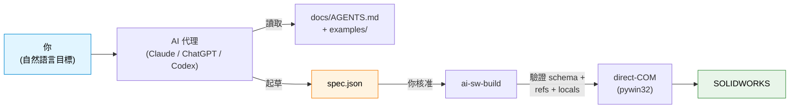

# ai-sw-bridge

> **讓 AI 助理驅動 SOLIDWORKS。** 把零件交給 Claude / ChatGPT / Codex，讓它產生、驗證並執行 JSON 規格 — 而不需要給它一個「什麼都能做」的按鈕進入你的 CAD 模型。

[](https://github.com/Thomas-Tai/ai-sw-bridge/actions/workflows/ci.yml)
[](../../../pyproject.toml)
[](../../../LICENSE)
[](#前置條件)

> **Language**: [English](../../../README.md) · 繁體中文

<!--
HERO ASSETS — TO RECORD AND PASTE LATER:

  1. Animated GIF (10-15 seconds):
       Side-by-side: PowerShell terminal running
         `ai-sw-build examples/motor_mount_plate/spec.json --no-dim`
       and SOLIDWORKS window showing the part materialise feature-by-feature.
       Suggested tool: ScreenToGif (free, Windows).
       Save as: assets/hero_mmp_build.gif
       Then replace this comment with:
         

  2. Static screenshot fallback (if the GIF is heavy):
       Final-state SW window with the completed MMP part visible.
       Save as: assets/hero_mmp_static.png
-->

## 這是什麼

一個連接 AI 代理與 SOLIDWORKS 的橋接器。你用自然語言描述一個零件；代理產出 JSON 規格；橋接器透過 COM API 驅動 SW 來建構它。每一次變更都是 **propose → approve → execute** — AI 未經你同意絕不碰你的 CAD 模型。



規格語言目前涵蓋 **12 種零件塑形基本操作**（草圖 (sketch)、擠出 (extrude)、切除、圓角 (fillet)、倒角 (chamfer)、陣列 (pattern)、鏡射 (mirror)、旋轉 (revolve)、孔 (hole)）。[查看完整基本操作清單 →](../../spec_reference.md)

## 5 分鐘快速入門

### 前置條件

- **Windows** — SOLIDWORKS 僅限 Windows，且橋接器使用 `pywin32`。
- **SOLIDWORKS 已安裝且正在執行** — 在 2024 SP1 上測試過；2021 SP5+ 亦可運作。
- **Python 3.10+** — 在 3.10、3.12、3.14 上測試過。

### 1. 安裝（約 2 分鐘）

```powershell
git clone https://github.com/Thomas-Tai/ai-sw-bridge.git
cd ai-sw-bridge
python -m venv .venv
.venv\Scripts\activate
pip install -e .
```

### 2. 冒煙測試（約 10 秒）

開啟 SOLIDWORKS（空白狀態即可），然後：

```powershell
ai-sw-probe                                              # 確認 COM 連線正常
ai-sw-build examples/filleted_box/spec.json --no-dim     # 建構一個 20x20x10 帶一個圓角的方盒
```

如果約 3 秒內在 SW 中出現一個帶圓角的小方盒，表示橋接器運作正常。

### 3. 將鑰匙交給你的 AI 助理

開啟 Claude / ChatGPT / Codex 並貼上：

> 我正在使用 **ai-sw-bridge** — 一個讓 AI 助理透過 COM API 驅動 SOLIDWORKS 的橋接器。在做任何事之前，請先閱讀 **[`docs/AGENTS.md`](../AGENTS.md)** — 它告訴你規則、規格格式、該複製哪個範例，以及什麼需要我確認才能執行。
>
> 我的目標：*在此描述你的零件 — 例如「建構一個 40 × 30 × 10 mm 的板子，四角有四個 Ø5 mm 穿孔，距各邊 5 mm。」*
>
> 請提出一份 JSON 規格供我審查，之後再執行 `ai-sw-build`。

代理會閱讀 [`docs/AGENTS.md`](../AGENTS.md)，挑選最接近的 [`examples/`](../../../examples/) 比對，起草規格，然後**停下來**等你審查。你核准後，自己執行指令，看著零件建構完成。這就是整個迴圈。

**卡住了？** 試試 [`examples/README.md`](../../../examples/README.md)（12 份可用規格，按基本操作分類）或 [`docs/known_limitations.md`](known_limitations.md)（新使用者常踩的坑）。

## 為什麼 AI 工程師應該關心

CAD 自動化過去十年是一個流暢建構器 API 與外掛框架的墳場（angelsix、xCAD、codestack、pyswx、pySldWrap）。它們全都沒有解決 AI 撰寫問題 — 全都預設由*人類*撰寫 VBA 或串接 `.box().hole()` 呼叫。AI 代理不是這樣思考的。

這裡有什麼不同：

1. **JSON 是 AI 原生的介面。** 規格是純資料，對 schema 驗證、對 locals 檔驗證、對特徵拓撲驗證 — *在任何 SW 呼叫觸發之前*。AI 擅長資料；橋接器擅長確保資料正確。
2. **晚期繫結 (late-binding) pywin32 處理了無聊的 95%。** Phase 0 證明了 direct-COM dispatch 涵蓋了我們需要的零件塑形 API 介面。少數無法封送處理 (marshal) 的方法（例如 `SelectByID2` 的 `Callout` OUT 參數）有文件記載的替代方案。[查看注意事項 →](../../known_gotchas.md)
3. **安全性是結構性的，不是願景。** `ai-sw-mutate` 提供了實實在在的 `propose → dry-run → review → commit` 狀態機。回滾驗證會從磁碟讀回檔案並比對。沒有 `--yolo` 旗標。
4. **CHM 是 API 簽章的真相來源。** 當一個呼叫回傳 `PARAMNOTOPTIONAL` 時，我們不猜 — 我們從 `sldworksapi.chm` 重新擷取並在執行時斷言參數數量。[查看 API 參考 →](../../api_reference.md)

完整故事（現有工具的領域調查、為什麼流暢 API 輸了、為什麼 JSON 贏了），請閱讀 [`docs/ai_driven_architecture_review.md`](../../ai_driven_architecture_review.md)。

## 包裝盒裡有什麼

`pip install -e .` 後你的 PATH 上會有五個 CLI 指令：

| 指令 | 功能 | 唯讀？ |
|---|---|---|
| `ai-sw-probe` | COM 連線檢查 | ✅ |
| `ai-sw-observe` | 檢查特徵、方程式、結合、螢幕截圖 — JSON 輸出 | ✅ |
| `ai-sw-mutate` | 對 `*_locals.txt` 變數進行 propose → dry-run → commit 變更 | ⚠️ 需核准 |
| `ai-sw-codegen` | 將錄製的 `.swp` 巨集針對 locals 檔進行參數化 | — |
| `ai-sw-build` | **透過 direct-COM 從 JSON 規格建構零件** ← v0.2 路線 | — |

`ai-sw-build` 的三種建構模式（AI 工作流程請使用 `--no-dim`；其他模式以速度換取即時方程式連結）。[為什麼 `--no-dim` 存在 →](why_no_addim2.md)

## 採用前應了解的限制

簡短清單。在撰寫自己的規格之前，[完整已知限制文件](known_limitations.md)是必讀的。

- **僅限 Windows。** 無商量餘地 — `pywin32` 只能在 Windows 上執行。
- **`AddDimension2` 在參數化模式下會開啟阻擋式彈窗。** 在 SW 2024 SP1 上，無法透過任何我們試過的使用者偏好切換來抑制。替代方案：`--no-dim` 模式完全跳過該呼叫（幾何以字面目標尺寸建構，無方程式連結）；`--deferred-dim` 在最後批次處理彈窗。AI 驅動流程應預設使用 `--no-dim`。
- **面草圖原點是零件原點投影，不是面重心。** 面草圖上的 `center` 偏移量是相對於 SW 將 (0,0,0) 投影到面上的位置，而不是視覺上的面中心。每個人都會踩到一次。已記載。
- **無組合件、無結合、無工程圖。** 僅限零件層級工作流程。
- **不是免費的「用英文描述零件就得到幾何」。** 規格語言是精確的；AI 產生的是規格 JSON，不是隨意文字。自然語言步驟發生在你與代理的對話中，在規格起草之前。

## 專案狀態

- **v0.1 — 在 SOLIDWORKS 2024 SP1 上通過生產驗證。** `probe` / `observe` / `mutate` / Path C `codegen` 全部正常運作。
- **v0.2（JSON 規格建構器）— Phase 1 GREEN。** Motor Mount Plate 以 7 個參數連結建構 10/10 特徵，三種模式全部通過。矩形方程式連結降級問題已於 2026-05-20 修復（Spike ZF）。[查看 CHANGELOG](../../../CHANGELOG.md)。
- **v0.3 — 已交付基本操作：** 倒角、線性陣列、鏡射、旋轉、簡單孔。
- **v0.4 下一步：** 環形陣列、變半徑圓角、±x/±y 面草圖。[查看 CHANGELOG →](../../../CHANGELOG.md)

## 目錄結構

```
ai-sw-bridge/
├── src/ai_sw_bridge/         # 橋接器本體
│   ├── spec/                 #   JSON 規格 → direct-COM 建構器
│   │   ├── builder.py        #     建構迴圈 + 非草圖處理器 + 註冊表
│   │   ├── sketches/         #     SketchHandler ABC + 5 個具體處理器
│   │   └── ...
│   └── cli/                  #   五個 CLI 進入點
├── examples/                 # 12 份可用規格（撰寫時從這裡開始）
├── docs/
│   ├── AGENTS.md             #   代理簡報 — AI 首先閱讀的內容
│   ├── spec_reference.md     #   每種基本操作的 schema 參考
│   ├── api_reference.md      #   CHM 驗證過的 SW API 介面
│   ├── known_limitations.md  #   坑 + 替代方案
│   ├── known_gotchas.md      #   我們辛苦學到的教訓
│   └── ai_driven_architecture_review.md  # 領域調查 + v0.2 設計
├── tools/                    # CHM 擷取器 + 特徵樹差異比對工具
├── spikes/                   # Phase 0 / v0.3 / v0.5 / v0.6 API 探測
└── tests/                    # 84 項測試，在 Python 3.10 / 3.12 / 3.14 上全部通過
```

## 授權

MIT。詳見 [LICENSE](../../../LICENSE)。

## 致謝

SOLIDWORKS API 模式：[CodeStack](https://www.codestack.net/solidworks-api/)。Path C 尺寸連結修復（`EquationMgr.Add2` 三參數形式）來自他們的 `document/dimensions/add-equation/` 範例。
