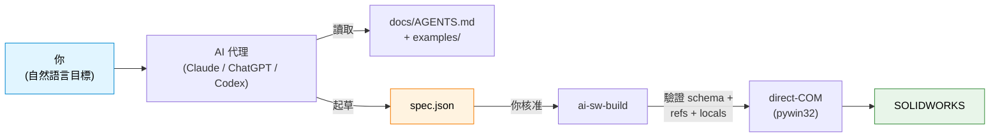
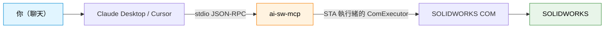

# ai-sw-bridge

> **從 AI 助理驅動 SOLIDWORKS。** 把要建構的零件交給 Claude / ChatGPT / Codex，讓它產生、驗證並執行 JSON 規格 — 完全不需要給它一個能「為所欲為」進入你 CAD 模型的按鈕。

[](https://github.com/Thomas-Tai/ai-sw-bridge/actions/workflows/ci.yml)
[](../../../pyproject.toml)
[](../../../LICENSE)
[](#prerequisites)

**Language**: [English](../../../README.md) · 繁體中文 · [简体中文](../zh-CN/README.md)

## 你是誰？→ 從這裡開始

這份 README 是一個**人格路由器 (persona router)**。選擇符合你身分的那一列，直接跳到為你撰寫的部分 — 其餘部分只是路標，不是必讀。這個頁面大部分是操作者主線；開發者與貢獻者則有簡短導覽與文件地圖。

| 你是… | 你想要… | 前往 |
|---|---|---|
| **操作者 (operator)** — SOLIDWORKS 使用者，不是工程師 | 安裝橋接器並從你的 AI 助理驅動它 | [**給操作者 — 5 分鐘快速入門**](#for-operators--5-minute-quickstart) · 接著把 [`docs/operator_guide.md`](../../operator_guide.md) 交給你的 AI |
| **開發者／整合者** | 呼叫 `SolidWorksClient`、嵌入 MCP 伺服器，或閱讀支援範圍合約 | [**給開發者與整合者**](#for-developers--integrators) |
| **貢獻者** | 新增特徵種類、修復牆、了解架構 | [**給貢獻者**](#for-contributors) |

初次使用只想讓它動起來？由上到下閱讀 **[給操作者](#for-operators--5-minute-quickstart)**，然後開啟權威版 [操作者指南](../../operator_guide.md) — 這是唯一一份要交給你 AI 助理的檔案。

## 這是什麼

一個連接 AI 代理與 SOLIDWORKS 的橋接器。你用自然語言描述一個零件；代理產出 JSON 規格；橋接器透過 COM API 驅動 SW 建構它。每一次變更都是 **propose → approve → execute** — AI 未經你點頭絕不會碰你的 CAD 模型。



規格語言目前涵蓋 **30 種零件塑型特徵類型**（13 種草圖 + 11 種擠出／旋轉 + 3 種修改 + 3 種陣列）。[查看完整清單 →](../../spec_reference.md)

自 **v0.13** 起，同一套工具介面也可以透過 MCP 伺服器（`ai-sw-mcp`）存取 — 自備 Claude Desktop、Cursor 或 Continue.dev。[跳到 MCP 章節 ↓](#mcp-server--drive-the-bridge-from-claude-desktop--cursor--etc)

### 規格長什麼樣子

你不需要撰寫 COM 呼叫或 VBA — 你用 JSON 描述零件。這正是下方冒煙測試所建構的範例（一個 20 × 20 × 10 mm 的方塊，帶一個 2 mm 圓角）：

```json
{
  "schema_version": 1,
  "name": "filleted_box_demo",
  "features": [
    { "type": "sketch_rectangle_on_plane", "name": "SK_Box",
      "plane": "Front", "width": 20.0, "height": 20.0 },
    { "type": "boss_extrude_blind", "name": "Extrude_Box",
      "sketch": "SK_Box", "depth": 10.0 },
    { "type": "fillet_constant_radius", "name": "Fillet_TopRightEdge",
      "radius": 2.0, "edges": [ { "x": 10.0, "y": 0.0, "z": 10.0 } ] }
  ]
}
```

特徵依宣告順序建構；每個 `name` 都能被後續特徵參照。任何長度可以是字面值（mm）或連結到 locals 檔中變數的 `{"rhs": "..."}`。完整文法在
[`docs/spec_reference.md`](../../spec_reference.md) — AI 通常會替你寫好（見下方步驟 3）。

---

## 給操作者 — 5 分鐘快速入門

**這是本專案的主幹。** 如果你會用 SOLIDWORKS 但不寫程式，你需要的一切都在這裡 — 更深入、對非工程師更友善的版本在權威版
**[操作者指南 → `docs/operator_guide.md`](../../operator_guide.md)**。

### 前置條件

> **提醒：這是一個 Python 開發者工具。** 你會在終端機使用 `pipx`（一個隔離式應用安裝器）與 JSON 規格檔工作。我們預設你已熟悉 Python 工具鏈 — 如果你從沒在命令列執行過 `python`，先看 [Python 新手指南](https://docs.python.org/3/using/index.html)，再回來。

- **Windows** — SOLIDWORKS 僅限 Windows，且橋接器使用 `pywin32`。
- **SOLIDWORKS 已安裝且正在執行** — 在 2024 SP1 上測試過；2021 SP5+ 亦可運作。
- **Python 3.10+、64 位元、在你的 `PATH` 上** — 在 3.10、3.12、3.14 上測試過。SOLIDWORKS 是 64 位元，所以你的 Python 也必須是 64 位元，否則 COM 無法附加。用 `python --version` 驗證；如果找不到這個指令，重新執行 Python 安裝程式並勾選**「Add python.exe to PATH」**。
- **Git 在你的 `PATH` 上** — `pipx` 透過 Git 抓取橋接器，所以 `git` 必須可用。用 `git --version` 驗證；如果沒有，安裝 [Git for Windows](https://git-scm.com/download/win)。
- **pipx** — 隔離式應用安裝器，能把 `ai-sw-*` 指令放上你的 `PATH`，不需要手動管理虛擬環境。安裝一次即可：`python -m pip install --user pipx`。

### 1. 安裝（約 2 分鐘）

安裝 [`pipx`](https://pipx.pypa.io/) 一次（如果還沒有的話），然後直接從 Git 把橋接器安裝進它自己的隔離環境 — 不需要手動 clone，不需要 venv：

```powershell
python -m pip install --user pipx
python -m pipx ensurepath            # 接著關閉並重新開啟你的終端機

pipx install "ai-sw-bridge[mcp] @ git+https://github.com/Thomas-Tai/ai-sw-bridge.git"
```

**一次性的 `pywin32` 步驟（最容易踩到的坑）。** COM 只有在 pywin32 的安裝後腳本在 *pipx 環境內部*註冊好其 DLL 之後才能附加：

```powershell
& "$(pipx environment --value PIPX_LOCAL_VENVS)\ai-sw-bridge\Scripts\python.exe" -m pywin32_postinstall -install
```

`[mcp]` extra（已包在上方指令中）會拉入 MCP SDK，讓 `ai-sw-mcp` 得以執行。`ai-sw-doctor`（下一步）會替你驗證 PATH 與這個 pywin32 步驟。

### 2. 飛行前檢查（約 5 秒）

在執行第一個真正的指令之前，先讓橋接器替你檢查機器狀態：

```powershell
ai-sw-doctor      # 檢查 Python / pywin32 / PATH / 一個存活的 SW seat / MCP 註冊狀態
```

`ai-sw-doctor` 是操作者飛行前檢查 — 它會為最容易搞砸首次安裝的四件事開綠燈（錯誤的位元數、缺少 `pywin32`、沒有 seat、PATH 缺漏）。繼續之前，先修好任何它標紅的項目。

### 3. 冒煙測試（約 10 秒）

開啟 SOLIDWORKS（空白狀態即可），然後：

```powershell
ai-sw-probe                                              # 確認 COM 連線正常
ai-sw-build examples/filleted_box/spec.json --no-dim     # 建構一個 20x20x10 帶一個圓角的方盒
```

`ai-sw-probe` 成功時會印出一個 JSON 物件（`{"ok": true, "sw_revision": "32.1.0", ...}`） — 如果 `ok` 是 `true`，表示 COM 連線正常。

接著 `ai-sw-build` 會在 stderr 印出一個 **seat 橫幅**，指名它即將驅動的確切 SOLIDWORKS（其 PID 與你目前開啟的文件），並暫停等待 `[y/N]` 確認。這就是安全閘門（Issue #7） — 目的是讓建構動作絕不會在你不知情的情況下發生在你的 session 裡。按下 **`y`**。（若要無人值守自動化，加上 `--yes`/`-y` 跳過提示。）

如果約 3 秒內在 SW 中出現一個帶圓角的小方盒，表示橋接器運作正常。

### 4. 把鑰匙交給你的 AI 助理

開啟 Claude / ChatGPT / Codex 並貼上：

> 我正在使用 **ai-sw-bridge** — 一個讓 AI 助理透過 COM API 驅動 SOLIDWORKS 的橋接器。在做任何事之前，請先閱讀 **[`docs/AGENTS.md`](../../AGENTS.md)** — 它會告訴你規則、規格格式、該複製哪個範例，以及執行前有哪些事需要我確認。
>
> 我的目標：*在此描述你的零件 — 例如「建構一個 40 × 30 × 10 mm 的板子，四角各有一個 Ø5 mm 通孔，距各邊 5 mm。」*
>
> 請提出一份 JSON 規格供我審查，之後再執行 `ai-sw-build`。

代理會閱讀 [`docs/AGENTS.md`](../../AGENTS.md)，挑選最接近的 [`examples/`](../../../examples/) 範例，起草規格，然後**停下來**等你審查。你核准後，自己執行指令，看著零件建構完成。這就是整個循環。

**卡住了？** 試試 [`examples/README.md`](../../../examples/README.md)（20 份可用規格，依基本操作分類）或 [`docs/known_limitations.md`](../../known_limitations.md)（新使用者常踩的坑）。完整的逐步教學 — 為不寫程式的 SOLIDWORKS 老手而寫 — 是 [操作者指南](../../operator_guide.md)。

**第一次跑不起來？**

| 症狀 | 最可能的原因 | 修法 |
|---|---|---|
| `ai-sw-probe` / `ai-sw-build`：*"command not found"* / *"not recognized"* | pipx 的 shim 目錄還沒在你的 `PATH` 上 | 執行 `pipx ensurepath`，然後關閉並重新開啟終端機 — 或執行 `ai-sw-doctor`，它會偵測到並告訴你 |
| `ai-sw-probe` 回傳 `ok: false` 或 COM 錯誤 | SOLIDWORKS 沒有在執行，或它的位元數跟你的 Python 不一致 | 啟動 SOLIDWORKS；使用 64 位元 Python（SW 是 64 位元） |
| `ai-sw-build` 卡住不動，SW 出現「Modify Dimension」彈窗 | 參數化模式每個尺寸都會開一個阻擋式對話框 | 使用 `--no-dim`（冒煙測試已經這麼做了） — [為什麼](../../why_no_addim2.md) |
| 建構前出現一個 `[y/N]` 提示 | 這是 seat 確認閘門，**不是**錯誤 | 按 `y` 繼續，或加上 `--yes` 供自動化使用 |

## 包裝盒裡有什麼

`pipx install` 之後，你的 PATH 上會有**22 個 CLI 指令 + 一個 MCP 伺服器**
（MCP 伺服器需要 `[mcp]` extra 才能*執行* — 見 [MCP 章節](#mcp-server--drive-the-bridge-from-claude-desktop--cursor--etc)）。
每個指令都宣告一個穩定性**分級**（`stable` / `experimental` / `deprecated`），
印在它的 `--help` 橫幅裡，並由 `tests/test_cli_stability.py` 強制驗證。
權威的「每指令分級」清單 + SemVer 承諾在
[`docs/PUBLIC_API.md`](./PUBLIC_API.md) — 那份檔案是支援範圍
合約；這張表只是親切導覽。

每個會變更狀態的指令都遵循同一套 **propose → approve → execute** 狀態機：AI 絕不會在沒有明確人為 / `--yes` 閘門的情況下變更模型。沒有 `--yolo` 旗標這回事。

| 指令 | 分級 | 功能 | 唯讀？ |
|---|---|---|---|
| `ai-sw-probe` | experimental | COM 連線檢查 — 透過 `GetActiveObject` 確認 SW 可連線 | ✅ |
| `ai-sw-doctor` | experimental | 操作者飛行前檢查 — 檢查 Python / pywin32 / PATH / 存活的 SW seat / MCP 註冊狀態 | ✅ |
| `ai-sw-observe` | stable | 檢查文件 / 特徵 / 方程式 / 結合 / bbox / 體積 / 自訂屬性 / 螢幕截圖 / 外掛 / MBD-PMI — JSON 輸出 | ✅ |
| `ai-sw-mutate` | stable | 對 `*_locals.txt` 變數變更執行 propose → dry-run → commit（或 undo）。子指令：`propose` / `dry_run` / `commit` / `undo`。提案會持久化到 `./proposals/`（可用 `AI_SW_BRIDGE_PROPOSALS` 覆寫）。 | ⚠️ 需核准 |
| `ai-sw-batch` | experimental | 人工把關的批次特徵提交。在 `[y/N]` 閘門後方執行一份多特徵計畫（來自 MCP `sw_batch_plan`）；成功的部分會持久化，遇到第一個錯誤即快速失敗。 | ⚠️ 需核准 |
| `ai-sw-assembly` | stable | Propose-Approve-Execute 組合件生命週期（元件 + 結合）。子指令：`propose` / `dry_run` / `commit`。僅限 CLI，絕不透過 MCP。 | ⚠️ 需核准 |
| `ai-sw-drawing` | stable | Propose-Approve-Execute 工程圖生命週期（視圖 + 註記）。子指令：`propose` / `dry_run` / `commit`。僅限 CLI，絕不透過 MCP。 | ⚠️ 需核准 |
| `ai-sw-properties` | stable | Propose-Approve-Execute 自訂屬性生命週期。子指令：`propose` / `dry_run` / `commit`。僅限 CLI，絕不透過 MCP。 | ⚠️ 需核准 |
| `ai-sw-configurations` | stable | 多檔案變體實體化。子指令：`propose` / `materialize`。將變體深度合併到基礎規格上，各自建構成獨立的 `.sldprt`。 | — |
| `ai-sw-sketch-relations` | experimental | Propose-Approve-Execute 草圖幾何關係（約束）。子指令：`propose` / `dry_run` / `commit`。僅限 CLI。 | ⚠️ 需核准 |
| `ai-sw-sketch-edit` | experimental | Propose-Approve-Execute 草圖編輯操作（Convert / Offset / Trim / Pattern）。子指令：`propose` / `dry_run` / `commit`。僅限 CLI。 | ⚠️ 需核准 |
| `ai-sw-codegen` | experimental | 針對 locals 檔將錄製好的 `.swp` 巨集參數化 | — |
| `ai-sw-build` | stable | **透過 direct-COM 從 JSON 規格建構零件。** 三種模式（`--no-dim`、`--deferred-dim`、參數化預設）。安全性：在第一次 COM 寫入前，於互動式 TTY 上印出目標 seat（PID + 目前開啟的文件）並暫停等待 `[y/N]`；`--yes`/`-y` 可為自動化跳過提示。驗證：`--validate-only`、`--dry-run`、`--lint`。可靠性：`--checkpoint[-encrypt]`、`--auto-retry`、`--reconnect`、`--verify-mass`。輸出：`--save-as`、`--save-format`。環境：`--disable-addins`/`--strict-addins`、`--enable-flag`/`--disable-flag`、`--log-level`/`--verbose`/`--quiet`、`--locale`。權威清單請執行 `ai-sw-build --help`。 | — |
| `ai-sw-history` | experimental | 查詢 L4 checkpoint 歷史 — `part` / `since` / `diff` / `rollback` 子指令 | ⚠️ rollback 會寫入 |
| `ai-sw-apidoc` | experimental | 對 SOLIDWORKS API CHM 語料庫的 RAG — `search` / `detail` / `members` / `examples` / `enum` 子指令。全新 clone 後第一次執行：`python tools/build_api_index.py` 以生成已提交的索引。 | ✅ |
| `ai-sw-memory` | experimental | **設計記憶 (Design-Memory) RAG** — 針對*你自己*的設計歷史（過去的提案／checkpoint）做語意搜尋。`build`（回填本機索引）/ `search` / `stats`。嵌入向量在**本機端**計算；索引是私有、已加入 gitignore 的產物。 | ✅ |
| `ai-sw-checkpoint` | experimental | 管理 L4 加密 — `info`（不需金鑰）/ `genkey` / `rekey` / `migrate` | — |
| `ai-sw-import` | experimental | 外部幾何匯入（STEP / IGES → `.sldprt`），含匯入診斷。選項：`--source`、`--output`、`--dry-run`、`--verify-volume`。 | — |
| `ai-sw-export-dxf-flat` | experimental | 鈑金展開圖 DXF 匯出（`export` 子指令）— 透過 `ExportToDWG2` 匯出，並驗證圖元數量。 | — |
| `ai-sw-motion` | experimental | 動態運動學驗證（`audit`）— 驅動一個結合走過它的自由度，逐步回報干涉／間隙。 | — |
| `ai-sw-solver` | experimental | 自動間隙求解器（`resolve-clearance`）— 驅動一個距離結合直到無碰撞為止，失敗時還原。 | ⚠️ 需核准 |
| `ai-sw-urdf` | experimental | URDF 匯出（組合件 → ROS 機器人模型）。`export` 會寫出 `.urdf` + 各元件的 STL 網格。不會變更 SW 模型。 | ✅ |
| `ai-sw-mcp` | daemon | **MCP 伺服器（stdio 傳輸）**，供 Claude Desktop、Cursor、Continue.dev 及其他支援 MCP 的用戶端使用。公開 37 個工具（讀取通道 + plan/elicit 把關的寫入）。透過上方 `pipx install` 中的 `[mcp]` extra 一併安裝。 | mixed |

三種 `ai-sw-build` 的建構模式（AI 工作流程請使用 `--no-dim`；其他模式以速度換取即時方程式連結）。[為什麼 `--no-dim` 存在 →](../../why_no_addim2.md)

### 可新增的特徵種類（36 種）

除了基礎零件之外，`ai-sw-build` / `ai-sw-batch`（以及透過 MCP 的 `sw_batch_plan`）
可以為模型新增以下 **36 個經 seat 驗證過**的 `feature_add` 種類。每一種都是透過幾何*效果*（體積／面／面積／弧長／比率的差量）驗證，絕不只是單純的「沒有錯誤」。即時的真相來源是 `client.features.list_kinds()`；在 out-of-process 被牆住的種類列在 [`docs/DEFERRED.md`](../../DEFERRED.md)。

| 群組 | 種類 |
|---|---|
| 修飾特徵 (Dress-up) | `fillet_constant_radius`、`fillet_face`、`variable_radius_fillet`、`chamfer`、`shell`、`draft` |
| 陣列 (Patterns) | `linear_pattern`、`circular_pattern`、`mirror_feature`、`sketch_driven_pattern` |
| 參考幾何 (Reference geometry) | `ref_plane`、`ref_axis`、`ref_point`、`coordinate_system`、`bounding_box`、`com_point`、`mate_reference` |
| 曲線 (Curves) | `composite`、`helix`、`spiral`、`project_curve`、`curve_through_xyz` |
| 曲面 (Surfaces) | `planar_surface`、`offset_surface`、`knit` |
| 鈑金 (Sheet metal) | `base_flange`、`hem`、`sketched_bend` |
| 掃出與造型 (Sweeps & shapes) | `sweep`、`sweep_cut`、`dome`、`wizard_hole` |
| 實體與布林運算 (Bodies & boolean) | `delete_body`、`intersect`、`scale` |
| 熔接 (Weldment) | `structural_weldment` |

```python
from ai_sw_bridge.client import SolidWorksClient
SolidWorksClient().features.list_kinds()   # -> the 36 kinds above, sorted
SolidWorksClient().features.supports("helix")   # -> True
```

### 環境變數

| 變數 | 預設值 | 控制內容 |
|---|---|---|
| `AI_SW_BRIDGE_CAPTURES` | `./captures` | `sw_screenshot` 寫入 PNG 的位置 |
| `AI_SW_BRIDGE_PROPOSALS` | `./proposals` | `ai-sw-mutate` 提案 JSON 檔持久化的位置 |
| `AI_SW_BRIDGE_FLAG_<NAME>` | 未設定 | 覆寫一個功能旗標（例如 `AI_SW_BRIDGE_FLAG_BREP_INTERROGATION=1`）。CLI 的 `--enable-flag`/`--disable-flag` 優先於環境變數。 |
| `NO_COLOR` | 未設定 | 從 stderr 輸出中去除 ANSI 色碼（由 `PlainFormatter` 遵循） |

`--checkpoint-encrypt env:NAME` 會在建構時從 `$NAME` 讀取 Fernet 金鑰；變數名稱由你自訂。

## MCP 伺服器 — 從 Claude Desktop / Cursor 等驅動橋接器

MCP 伺服器（v0.13 新增）透過 stdio 向支援 MCP 的 AI 用戶端公開 37 個工具。與 CLI 相同的觀察 + 規劃介面；只是傳輸方式不同。工具集合的名稱與 payload 結構被
`tests/mcp_lane/test_server_contract.py`（`EXPECTED_TOOLS`）釘住 — 那個測試就是合約，因此任何新增／移除／重新命名都會讓 CI 失敗。



### 設定、註冊與完整工具清單

**設定**（安裝並向 Claude Desktop / Cursor 註冊）、**完整的 37 個工具
清單**、兩個**elicit 把關的寫入工具**（`sw_build`、
`sw_batch_execute`），以及**刻意僅限 CLI** 的介面，都記載在
[`docs/mcp_server_design.md`](../../mcp_server_design.md)（§6.6 — 操作者設定與
目前的工具清單）。

快速版本：如果你已經照著
[操作者快速入門](#for-operators--5-minute-quickstart) 做過，`[mcp]` extra
已經安裝好了 — 把你的 MCP 用戶端指向 `ai-sw-mcp` 執行檔
（`where ai-sw-mcp`），然後重新啟動用戶端。接著問，例如「目前這個零件的 bounding
box 是多少？」，模型就會選用 `sw_bbox`。

[完整 MCP 伺服器設計 + 協定細節 →](../../mcp_server_design.md)

## 採用前應了解的限制

簡短清單。[完整的已知限制文件](../../known_limitations.md)是撰寫自己規格之前的必讀內容。

- **僅限 Windows。** 無商量餘地 — `pywin32` 只能在 Windows 上執行。
- **`AddDimension2` 在參數化模式下會開啟阻擋式彈窗。** 在我們試過的 SW 2024 SP1 上，無法透過任何使用者偏好切換來抑制。替代方案：`--no-dim` 模式完全跳過該呼叫（幾何以字面目標尺寸建構，無方程式連結）；`--deferred-dim` 會在最後批次處理彈窗。AI 驅動流程應預設使用 `--no-dim`。
- **面草圖原點是零件原點的投影，不是面的重心。** 面草圖上的 `center` 偏移量是相對於 SW 把 (0,0,0) 投影到面上的位置，而不是視覺上的面中心。每個人都會踩到一次。已記載。
- **部分進階特徵在 out-of-process 被牆住。** 少數特徵種類（例如 `loft`、`combine`、`split`、`wrap`、鈑金中依草圖輪廓成形的凸緣）無法跨越 COM 邊界實體化，被登記為 `DORMANT`/`WALLED` — 它們會明確失敗，而不是默默地無動作。核心層邊界分類詳見 [`docs/DEFERRED.md`](../../DEFERRED.md)。
- **不是免費送你「用英文描述零件就拿到幾何」。** 規格語言是精確的；AI 產生的是規格 JSON，不是隨意文字。自然語言的步驟發生在你與代理的對話中，在規格起草之前。

---

## 給開發者與整合者

`ai-sw-bridge` 同時也是一個 Python 函式庫和一個可嵌入的 MCP 伺服器。一個公開
進入點 — `SolidWorksClient` — 面向整個介面；CLI 與 MCP
伺服器都只是它上面的薄殼。從這四份文件開始：

- **[`docs/PUBLIC_API.md`](./PUBLIC_API.md)** — 支援範圍合約：每一個公開符號、它的穩定性分級，以及 SemVer 承諾。
- **[`docs/tools_reference.md`](../../tools_reference.md)** — 權威版 CLI + MCP 工具參考（旗標、子指令、payload 結構）。
- **[`docs/AGENTS.md`](../../AGENTS.md)** — 代理簡報：規則、規格格式，以及哪些事需要人為確認。把這份文件交給任何與你搭檔的 AI。
- **[`USAGE.md`](./USAGE.md)** — Python 客戶端與 CLI 的端到端使用範例。

### 為什麼 AI 工程師應該關心

CAD 自動化過去十年是一片流暢建構器 API 與外掛框架的墳場（angelsix、xCAD、codestack、pyswx、pySldWrap）。它們沒有一個解決了 AI 撰寫問題 — 全都假設是*人類*在寫 VBA 或串接 `.box().hole()` 呼叫。AI 代理不是這樣思考的。

這裡有什麼不同：

1. **JSON 是 AI 原生的介面。** 規格是純資料，會依 schema 驗證、依 locals 檔驗證、依特徵拓撲驗證 — 全部發生在*任何 SW 呼叫觸發之前*。AI 擅長處理資料；橋接器擅長確保資料正確。
2. **晚期繫結 (late-binding) 的 pywin32 處理了無聊的那 95%。** Phase 0 證明了 direct-COM dispatch 涵蓋我們需要的零件塑型 API 介面。少數無法封送 (marshal) 的方法（例如 `SelectByID2` 的 `Callout` OUT 參數）都有文件記載的替代方案。[看那些注意事項 →](../../known_gotchas.md)
3. **安全性是結構性的，不是一廂情願。** `ai-sw-mutate` 提供了一套實實在在的 `propose → dry-run → review → commit` 狀態機。回滾驗證會從磁碟讀回檔案並比對。沒有 `--yolo` 旗標。
4. **CHM 是 API 簽章的真相來源。** 當一次呼叫回傳 `PARAMNOTOPTIONAL` 時，我們不用猜的 — 我們會從 `sldworksapi.chm` 重新擷取，並在執行期斷言參數數量。產生出的參考文件（`api_reference.md`）不會提交進版本庫 — 用 [`tools/_api_extract_input.json`](../../../tools/_api_extract_input.json) 在本機重新產生；在本機產生的超集是 `docs/sw_api_full.md`（未提交進版本庫）。

架構與設計理念（為什麼選擇 JSON 規格而非流暢 API、分層模型），請閱讀 [`docs/CLASS_RELATION_MAP.md`](../../CLASS_RELATION_MAP.md)。

## 給貢獻者

要新增特徵種類、修復核心層邊界牆，還是想理解分層模型？這些是你的切入點：

- **[`CONTRIBUTING.md`](../../../CONTRIBUTING.md)** — 開發者工作流程、逐檔案的移植歸屬，以及 [CLA](../../../CLA.md)。新增一個 `feature_add` 種類代表要註冊一個處理器*並*滿足它的合約義務（README 種類表、一個範例，以及一個幾何效果測試）。
- **[`docs/CLASS_RELATION_MAP.md`](../../CLASS_RELATION_MAP.md)** — 架構地圖：`client` → 外觀 (facades) → 註冊表 → COM，以及設計理念。
- **[`CODESTYLE.md`](../../../CODESTYLE.md)** — 橫切關注的程式碼紀律（雙串流 I/O、fail-soft、STA 執行緒）。

離線測試套件就是規格：它必須維持全綠（`pytest`，3,700+ 項測試），加上 live-SW 的 `solidworks_only` 通道，以及供 seat-proof 工作用的破壞性 `destructive_sw` 復原通道。

## 專案狀態

**目前版本：`v1.7.0` — 商業版，Production/Stable。** 一個公開的 Python
進入點（`SolidWorksClient`）、22 個 CLI 指令、一個 37 個工具的 MCP 伺服器，以及一個
36 種 `feature_add` 的註冊表，架在 `ai-sw-batch` / `ai-sw-mutate` 介面之後。
已針對 SOLIDWORKS 32.1.0（2024 SP1）驗證過；CI 在 Win-2025 × Python
3.10 / 3.12 / 3.14 上維持全綠。離線套件有 **3,700+ 項測試**，
加上一條 live-SW 的端到端通道（`solidworks_only`）與一條破壞性 seat-死亡
復原通道（`destructive_sw`）。

里程碑弧線（完整細節見 [CHANGELOG.md](../../../CHANGELOG.md)）：

- **v0.1–v0.3 — 基礎建設。** `probe` / `observe` / `mutate` / Path C `codegen`；
  JSON 規格建構器（Motor Mount Plate、三種建構模式）；最初的基本操作。
- **v0.10–v0.13 — 可靠性與智慧化。** 功能旗標、斷路器、
  SLI 基準線、雙串流合約、CLI 穩定性分級；B-rep 詢問、
  COM 錯誤封套、RAG API 文件檢索、L4 SQLite checkpoint + 靜態的
  Fernet 加密；`ai-sw-mcp` 伺服器 + STA 執行緒的 `ComExecutor`。
- **v0.14–v0.18 — 能力紀元。** 組合件與結合、工程圖與註記、
  自訂屬性、多檔案組態、草圖編輯、曲面、
  鈑金、曲線、參考幾何、熔接 — 以及整合為
  單一 `SolidWorksClient` 外觀（移除了自由函式 `sw_*`）。
- **v1.0.0 — GA**（2026-06-23）。第一個穩定版本；`SolidWorksClient` 外觀
  是唯一支援的 Python API，SemVer 正式生效。
- **v1.1–v1.4 — 代理式批次與可觀察性。** 交易式多特徵
  `client.mutate.batch()` + `sw_batch_plan` / `sw_batch_execute`；`intersect`
  通道；MBD/DimXpert PMI 可觀察性（`sw_observe_mbd`）。
- **v1.5.0 — 執行期韌性與設計智慧。** `SupervisedSession`
  當機復原封套（偵測 → 重生 → 冪等重播，已在真實 seat 上驗證過），以及一套本機端、
  裝置端運算的設計記憶 RAG（`ai-sw-memory`）。
- **v1.6.0 — 自我修復批次 + 統一寫入閘門**（2026-06-26）。監督式
  復原成為批次路徑的**預設**行為；**兩個** MCP 寫入工具（`sw_build`、
  `sw_batch_execute`）都把每一次磁碟寫入把關在聊天內人為核准之後（MCP
  elicitation）；專有商業授權；CI 強化（black / flake8 /
  mypy / import-linter / coverage / 密鑰與 CVE 掃描，全部阻擋式）。

支援範圍合約請見 [`docs/PUBLIC_API.md`](./PUBLIC_API.md)，
架構地圖請見 [`docs/CLASS_RELATION_MAP.md`](../../CLASS_RELATION_MAP.md)。

## 目錄結構

```
ai-sw-bridge/
├── src/ai_sw_bridge/         # 橋接器本體
│   ├── spec/                 #   JSON 規格 → direct-COM 建構器
│   │   ├── builder.py        #     建構迴圈 + 非草圖處理器 + 註冊表
│   │   ├── sketches/         #     SketchHandler ABC + 5 個具體處理器
│   │   └── ...
│   ├── brep/                 # L1 — B-rep 詢問（逐特徵清單）
│   ├── errors/                # L2 — build_error / wrapper / hints / circuit_breaker / auto_retry
│   ├── rag/                  # L3 — API RAG（sqlite-vec 索引 + embedder）
│   ├── checkpoint/           # L4 — SQLite checkpoint（store / snapshot / rollback / crypto）
│   ├── com/                  #     ComExecutor + adapter 工廠（STA 執行緒 COM 安全性）
│   ├── mcp/                  # Lane M — MCP 伺服器（FastMCP + @com_tool 裝飾器）
│   ├── telemetry/            # 本機端 SQLite 指標 + trace ID（無 PII / 不自動上傳）
│   ├── flags/                # 功能旗標註冊表 + 優先順序解析器
│   └── cli/                  # 22 個 CLI 進入點（分級於 cli/stability.py）
├── examples/                 # 已驗證的範例規格（撰寫時從這裡開始）
├── docs/
│   ├── AGENTS.md             #   代理簡報 — AI 首先閱讀的內容
│   ├── operator_guide.md     #   權威版操作者指南（交給你的 AI）
│   ├── spec_reference.md     #   每種基本操作的 schema 參考
│   ├── api_reference.md      #   CHM 驗證過的 SW API 介面
│   ├── known_limitations.md  #   坑 + 替代方案
│   ├── known_gotchas.md      #   我們辛苦學到的教訓
│   ├── DEFERRED.md           # ← v0.14+ 待辦事項 + 無限期延後的項目
│   ├── ROADMAP.md
│   ├── mcp_server_design.md  # ← MCP 伺服器協定 + 工具清單 + 設計理念
│   ├── checkpoint_encryption_design.md  # ← L4 靜態加密（Fernet，4 種金鑰來源）
│   └── CLASS_RELATION_MAP.md  # client / 外觀 / 註冊表 / COM 關係圖
├── tools/                    # CHM 擷取器、drift/license lint、bundle、效能基準線、probe_mcp_tools、checkpoint_redact、spec_redact、example_roundtrip
├── spikes/                   # Phase 0 / v0.3 / v0.5 / v0.6 API 探測
├── tests/                    # 3,750 項離線測試，在 Python 3.10 / 3.12 / 3.14 上全部通過
│   ├── e2e_sw/               # 針對 live SW 的端到端套件（solidworks_only marker）
│   ├── fault_injection/      # COM HRESULT 注入（獨立 CI job）
│   ├── mcp_lane/             # MCP 伺服器合約 + wire-level + 快照 fixture
│   └── onboarding/           # 快速入門冒煙測試（不需要 SW）
├── CODESTYLE.md              # 橫切關注的程式碼紀律（雙串流、fail-soft、STA 等）
└── CONTRIBUTING.md           # 開發者工作流程 + 逐檔案移植歸屬
```

## 授權

商業／專有授權 — 詳見 [LICENSE](../../../LICENSE)（自 v1.5.0 起為法務審閱範本）。v1.0.0–v1.4.0
版本曾以 MIT 授權發布，並仍依該等條款提供。內含的第三方元件
保留各自的授權 — 詳見 [THIRD-PARTY-NOTICES.md](../../../THIRD-PARTY-NOTICES.md)。
貢獻內容依 [CLA](../../../CLA.md) 條款接受。

## 致謝

SOLIDWORKS API 模式：[CodeStack](https://www.codestack.net/solidworks-api/)。Path C 尺寸繫結修復（`EquationMgr.Add2` 三參數形式）來自他們的 `document/dimensions/add-equation/` 範例。

包含改編自 [SolidworksMCP-python](https://github.com/andrewbartels1/SolidworksMCP-python)（MIT，ESPO Corporation 2025）的程式碼；詳見 [THIRD-PARTY-NOTICES.md](../../../THIRD-PARTY-NOTICES.md)。
